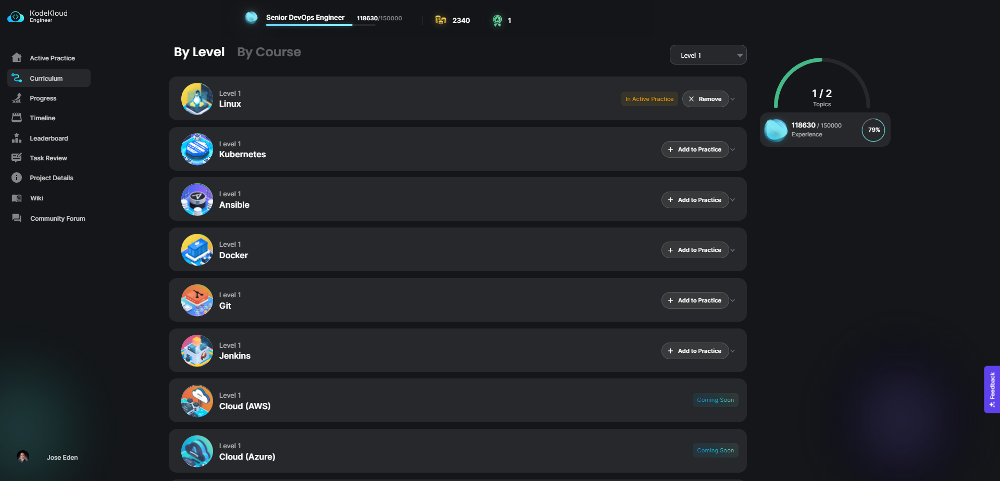

# Kodekloud Engineer Labs 

This repository contains all my notes for ~~past~~ Kodekloud Engineer tasks which are all performed in a live Linux environment. These tasks simulate actual enterprise challenges and mimics the day-to-day work of System Administrators and Devops Engineers.

For each task, a set of requirements are given. The documentations for the servers are also provided. It is up for the "engineer" to find the solution for each problem.

To learn more, check out [Kodekloud Engineer-Getting Started.](https://kodekloudhub.github.io/kodekloud-engineer/docs/getting-started)

----------------------------------------------

- [Roles](#roles)
- [Updates](#updates)
    - [Mechanics](#mechanics)
    - [Markdown for tasks 57 and onwards](#markdown-for-tasks-57-and-onwards)
    - [Public Profile](#public-profile)
    - [Change in mechanics](#change-in-mechanics)
- [Labs - Systems Administrator](#systems-administrator)
- [Labs - DevOps Engineer](#devops-engineer)
- [Labs - Senior DevOps Engineer](#senior-devops-engineer)
- [Labs - Per Category](#categories)
    - [Linux](#linux)
    - [Kubernetes](#kubernetes)
    - [Ansible](#ansible)
    - [Docker](#docker)
    - [Git](#git)

----------------------------------------------

## Roles

Role/Level | Points Needed
---------|----------
 [Systems Administrator](#systems-administrator) | Entry-level
 [DevOps Engineer](#devops-engineer) | 25,000 
 [Senior DevOps Engineer](#devops-engineer) | 75,000
 [DevOps Architect](#devops-engineer) | 150,000

More details can be found [here](https://kodekloud.com/community/t/updates-new-roles/13242).

## Updates

 [2022-Nov-29] - Mechanics  

### Mechanics 

Here's how the "Kodekloud Engineer" gamified learning works:

- The tasks are given in a random order.
- Some tasks are given more than once. 
- For tasks with buggy lab, better to skip them.
- You will need to wait for 24 hours for the next task to arrive.

 [2022-Nov-29] - Markdown for tasks 57 and onwards 

### Markdown for tasks 57 and onwards

When I started going deep into Linux ~~two years ago~~ at the start of 2020, I didn't know much about markdown files so I just dump all the notes for each tasks in ".sh" files. I've learn so much about markdown since then and I've been using this format in all my documentations, both for my personal notes and work notes.

Having said, you will see tasks 1 to 56 are all in ".sh" files. I didn't want to edit them because they showed how much I don't know before and the tasks 57 and onwards shows how much I've grown since.

 [2022-Nov-29] - Public Profile 

### Public Profile

Profiles can now be shared publicly. These allows engineers to showcase the challenges they have solved.

See my public profile here: [Kodekloud Engineer](https://kodekloud-engineer.com/#!/user_profile?uid=15930992248539436)

 [2023-July-26] - Change in mechanics  

### Change in mechanics 

There's been a change in how Kodekloud "gives tasks" to engineers. 
Previously the tasks are given one at a time, and the engineer needs to finish the current task, and then wait for 24 hours for the next task to arrive.

Kodekloud has change the approach by:

- Setting different levels for separate categories
- The engineer can answer as many tasks as they can, as long as they have "Kodekloud coins".
- Each task cost a number of coins and it is also equivalent to a number of experience points 

See screenshot below:

## Systems Administrator

✔️ Task 001 - [Create a Linux User with Non-Interactive Shell](./Tasks_001-009/TASK_1-Create_a_Linux_user_with_non-interactive_shell.sh)   
✔️ Task 002 - [Linux Run levels](./Tasks_001-009/TASK_2-Linux_Run_Levels.sh)   
✔️ Task 003 - [Linux SSH Authentication](./Tasks_001-009/TASK_3-Linux_SSH_Authentication.sh)   
✔️ Task 004 - [Create a Cron job](./Tasks_001-009/TASK_4-Create_a_Cron_Job.sh)   
✔️ Task 005 - [Create a user](./Tasks_001-009/TASK_5-Create_a_User.sh)   
✔️ Task 006 - [MariaDB Troubleshooting](./Tasks_001-009/TASK_6-MariaDB_Troubleshooting.sh)   
✔️ Task 007 - [Linux Banner](./Tasks_001-009/TASK_7-Linux_Banner.sh)   
✔️ Task 008 - [Selinux Installation](./Tasks_001-009/TASK_8-Selinux_installation.sh)   
✔️ Task 009 - [DNS Troubleshooting](./Tasks_001-009/TASK_9-DNS_Troubleshooting.sh)   
✔️ Task 010 - [Linux Services](./Tasks_010-020/TASK_10-Linux_Services.sh)   
✔️ Task 011 - [NFS Troubleshooting](./Tasks_010-020/TASK_11-NFS_Troubleshooting.sh)   
✔️ Task 012 - [Linux User without Home](./Tasks_010-020/TASK_12-Linux_User_Without_Home.sh)   
✔️ Task 013 - [Linux User Expiry](./Tasks_010-020/TASK_13-Linux_User_Expiry.sh)   
✔️ Task 014 - [Linux Archives](./Tasks_010-020/TASK_14-Linux_Archives.sh)   
✔️ Task 015 - [Disable Root Login](./Tasks_010-020/TASK_15-Disable_Root_Login.sh)   
✔️ Task 016 - [Apache Troubleshooting](./Tasks_010-020/TASK_16-Apache_Troubleshooting.sh)   
✔️ Task 017 - [Create a group](./Tasks_010-020/TASK_17-Create_a_group.sh)   
✔️ Task 018 - [Linux String Substitute](./Tasks_010-020/TASK_18-Linux_String_Substitute.sh)   
✔️ Task 019 - [Linux Firewalld Rules](./Tasks_010-020/TASK_19-Linux_Firewalld_Rules.sh)   
✔️ Task 020 - [Linux Remote Copy](./Tasks_010-020/TASK_20-Linux_Remote_Copy.sh)   
✔️ Task 021 - [HAproxy LBR Troubleshooting](./Tasks_021-030/TASK_21-Haproxy_LBR_Troubleshooting.sh)   
✔️ Task 022 - [Linux Bash Scripts](./Tasks_021-030/TASK_22-Linux_Bash_Scripts.sh)   
✔️ Task 023 - [Configure Local Yum Repos](./Tasks_021-030/TASK_23-Configure_Local_Yum_repos.sh)   
✔️ Task 024 - [Linux Resource Limits](./Tasks_021-030/TASK_24-Linux_Resource_Limits.sh)   
✔️ Task 025 - [Configure Protected Directories](./Tasks_021-030/TASK_25-Configure_protected_directories_in_Apache.sh)   
✔️ Task 026 - [Linux NGINX as Reverse Proxy](./Tasks_021-030/TASK_26-Linux_Nginx_as_Reverse_Proxy.sh)   
✔️ Task 027 - [Web Server Security](./Tasks_021-030/TASK_27-Web_Server_Security.sh)   
✔️ Task 028 - [Setup SSL for NGINX](./Tasks_021-030/TASK_28-Setup_SSL_for_Nginx.sh)   
✔️ Task 029 - [Application Security](./Tasks_021-030/TASK_29-Application_Security.sh)   
✔️ Task 030 - [Install a package - git](./Tasks_021-030/TASK_30-Install_a_package_-_vsftpd.sh)   
✔️ Task 031 - [Linux Find Command](./Tasks_031-040/TASK_31-Linux_Find_Command.sh)   
✔️ Task 032 - [Install and Configure HAproxy LBR](./Tasks_031-040/TASK_32-Install_and_Configure_HaProxy_LBR.sh)   
✔️ Task 033 - [Linux Firewalld Setup](./Tasks_031-040/TASK_33-Linux_Firewalld_Setup.sh)   
✔️ Task 034 - [Install and Configure NFS Server](./Tasks_031-040/TASK_34-Install_and_Configure_NFS_Server.sh)   
✔️ Task 035 - [PAM Authentication for Apache](./Tasks_031-040/TASK_35-PAM_Authentication_For_Apache.sh)   
✔️ Task 036 - [Install and Configure PostgreSQL](./Tasks_031-040/TASK_36-Install_and_Configure_PostgreSQL.sh)   
✔️ Task 037 - [Linux Process Troubleshooting](./Tasks_031-040/TASK_37-Linux_Process_Troubleshooting.sh)   
✔️ Task 038 - [Install and Configure SFTP](./Tasks_031-040/TASK_38-Install_And_Configure_SFTP.sh)   
✔️ Task 039 - [Install and Configure Tomcat](./Tasks_031-040/TASK_39-Install_and_Configure_Tomcat_Server.sh)   
✔️ Task 040 - [IPTables Installation and Configuration](./Tasks_031-040/TASK_40-IPtables_Installation_And_Configuration.sh)   
✔️ Task 041 - [Linux network Services](./Tasks_041-050/TASK_41-Linux_Network_Services.sh)   
✔️ Task 042 - [Install and Configure Web Application](./Tasks_041-050/TASK_42-Install_and_Configure_Web_Application.sh)   
✔️ Task 043 - [Install and Configure DB Server](./Tasks_041-050/TASK_43-Install_and_Configure_DB_Server.sh)   
✔️ Task 044 - [Linux SSH Authentication](./Tasks_041-050/TASK_44-Linux_SSH_Authentication.sh)   
✔️ Task 045 - [MariaDB Troubleshooting](./Tasks_041-050/TASK_45-MariaDB_Troubleshooting.sh)   
✔️ Task 046 - [Install and Configure Web Application](./Tasks_041-050/TASK_46-Install_and_Configure_Web_Application.sh)   
✔️ Task 047 - [Create a Linux User with Non-Interactive Shell](./Tasks_041-050/TASK_47-Create_a_Linux_User_with_non-interactive_shell.sh)   
✔️ Task 048 - [Configure Local Yum Repos](./Tasks_041-050/TASK_48-Configure_Local_Yum_repos.sh)   
✔️ Task 049 - [Linux FIrewalld Setup](./Tasks_041-050/TASK_49-Linux_Firewalld_Setup.sh)   
✔️ Task 050 - [Install and Configure PostgreSQL](./Tasks_041-050/TASK_50-Install_and_Configure_PostgreSQL.sh)   
✔️ Task 051 - [Linux Firewalld Rules](./Tasks_051-060/TASK_51-Linux_Firewalld_Rules.sh)   
✔️ Task 052 - [Apache Troubleshooting](./Tasks_051-060/TASK_52-Apache_Troubleshooting.sh)   
✔️ Task 053 - [Create a Linux User with Non-Interactive Shell](./Tasks_051-060/TASK_53-Create_a_Linux_User_with_non-interactive_shell.sh)   
✔️ Task 054 - [Setup SSL for NGINX](./Tasks_051-060/TASK_54-Setup_SSL_for_NGINX.sh)   
✔️ Task 055 - [Install and Configure HAProxy LBR](./Tasks_051-060/TASK_55-Install_and_Configure_HAProxy_LBR.sh)   

## DevOps Engineer

✔️ Task 056 - [Save. Load, and Transfer Docker Image](./Tasks_051-060/TASK_56-Save-load-transfer-Docker-image.sh)   
✔️ Task 057 - [Manage Secrets in Kubernetes](./Tasks_051-060/TASK_57-Manage_secrets_in_Kubernetes.md)   
✔️ Task 058 - [Creating Soft Links Using Ansible](./Tasks_051-060/TASK_58-Creating_softlinks_using_Ansible.md)   
✔️ Task 059 - [Ansible Basic Playbook](./Tasks_051-060/TASK_59-Ansible_Basic_Playbook.md)   
✔️ Task 060 - [Git Fork a Repository](./Tasks_051-060/TASK_60-Git_Fork_a_Repository.md)   
✔️ Task 061 - [Deploy Grafana on Kubernetes Cluster](./Tasks_061-070/TASK_61-Deploy_Grafana_on_Kubernetes.md)   
✔️ Task 062 - [Deploy Jenkins on Kubernetes](./Tasks_061-070/TASK_62-Deploy_Jenkins_on_Kubernetes.md)   
✔️ Task 063 - [Create Namespaces on Kubernetes Cluster](./Tasks_061-070/TASK_63-Create_Namespaces_in_Kubernetes.md)   
✔️ Task 064 - [Ansible Copy Module](./Tasks_061-070/TASK_64-Ansible_Copy_Module.md)   
✔️ Task 065 - [Manage Git Repositories](./Tasks_061-070/TASK_65-Manage_Git_repositories.md)   
✔️ Task 066 - [Update an Existing Deployment in Kubernetes](./Tasks_061-070/TASK_66_Update_existing_Deployment_in_Kubernetes.md)   
✔️ Task 067 - [Managing Jinja2 Templates Using Ansible](./Tasks_061-070/TASK_67_Managing_Jinja2_Templates.md)   
✔️ Task 068 - [Puppet Install a Package](./Tasks_061-070/TASK_68_Puppet-Install_a_Package.md)   
✔️ Task 069 - [Ansible Lineinfile Module](./Tasks_061-070/TASK_69-Ansible_Lineinfile_Module.md)   
✔️ Task 070 - [Setup Puppet Certs Autosign](./Tasks_061-070/TASK_70-Setup_Puppet_Certs_Autosign.md)   
✔️ Task 071 - [Create a Docker Network](./Tasks_071-080/TASK_71-Create_a_Docker_Network.md)   
✔️ Task 072 - [Create Deployments in Kubernetes Cluster](./Tasks_071-080/TASK_72-Create_Deployments_in_Kubernetes_Cluster.md)   
✔️ Task 073 - [Ansible Inventory Update](./Tasks_071-080/TASK_73-Ansible_Inventory_Update.md)   
✔️ Task 074 - [Create Replicaset in Kubernetes Cluster](./Tasks_071-080/TASK_74-Create_Replicaset_in_Kubernetes_Cluster.md)   
✔️ Task 075 - [Puppet String Manipulation](./Tasks_071-080/TASK_75-Puppet_String_Manipulation.md)   
✔️ Task 076 - [Run a Docker Container](./Tasks_071-080/TASK_76-Run_a_Docker_Container.md)   
✔️ Task 077 - [Init Containers in Kubernetes](./Tasks_071-080/TASK_77-Init_containers_in_Kubernetes.md)   
✔️ Task 078 - [Rollback a Deployment in Kubernetes](./Tasks_071-080/TASK_78-Rollback_deployment_in_Kubernetes.md)   
✔️ Task 079 - [Puppet Setup SSH Keys](./Tasks_071-080/TASK_79-Puppet_Setup_SSH_Keys.md)   
✔️ Task 080 - [Deploy MySQL on Kubernetes](./Tasks_071-080/TASK_80-Deploy_MySQL_on_Kubernetes.md)   
✔️ Task 081 - [Ansible Facts Gathering](./Tasks_081-090/TASK_81_Ansible_Facts_Gathering.md)   
✔️ Task 082 - [Create Cronjobs in Kubernetes](./Tasks_081-090/TASK_82_Create_Cronjobs_in_Kubernetes.md)   
✔️ Task 083 - [Deploy Tomcat App on Kubernetes](./Tasks_081-090/TASK_83_Deploy_Tomcat_on_Kubernetes.md)   
✔️ Task 084 - [Fix Python App Deployed on Kubernetes Cluster](./Tasks_081-090/TASK_84_Fix_Python_App.md)   
✔️ Task 085 - [Rolling Updates in Kubernetes](./Tasks_081-090/TASK_85_Rolling_Updates_in_Kubernetes.md)   
✔️ Task 086 - [Ansible Archive Module](./Tasks_081-090/TASK_86_Ansible_Archive_Module.md)   
✔️ Task 087 - [Ansible Config File Update](./Tasks_081-090/TASK_87_Ansible_Config_File_Update.md)   
✔️ Task 088 - [Ansible Create Users and Groups](./Tasks_081-090/TASK_88_Ansible_Create_Users_and_Groups.md)   
✔️ Task 089 - [Kubernetes Sidecar Containers](./Tasks_081-090/TASK_89_Kubernetes_Sidecar_Containers.md)   
✔️ Task 090 - [Using Ansible Conditionals](./Tasks_081-090/TASK_90_Using_Ansible_Conditionals.md)   
✔️ Task 091 - [Ansible Setup Httpd and PHP](./Tasks_091-100/TASK_91_Ansible_Setup_HTTPD_and_PHP.md)   
✔️ Task 092 - [Print Environment Variables](./Tasks_091-100/TASK_92_Print_Environment_Variables.md)   
✔️ Task 093 - [Set Limits for Resources in Kubernetes](./Tasks_091-100/TASK_93_Set_Limits_for_Resources.md)   
✔️ Task 094 - [Kubernetes Troubleshooting](./Tasks_091-100/TASK_94_Kubernetes_Troubleshooting.md)   
✔️ Task 095 - [Ansible Blockinfile Module](./Tasks_091-100/TASK_95_Ansible_Blockinfile_module.md)   
✔️ Task 096 - [Countdown job in Kubernetes](./Tasks_091-100/TASK_96_Countdown_job_in_Kubernetes.md)   
✔️ Task 097 - [Docker Ports Mapping](./Tasks_091-100/TASK_97_Docker_Ports_Mapping.md)   
✔️ Task 098 - [Troubleshoot Issue With Pods](./Tasks_091-100/TASK_98_Troubleshoot_issue_with_Pods.md)   
✔️ Task 099 - [Ansible Replace Module](./Tasks_091-100/TASK_99_Ansible_Replace_Module.md)   
✔️ Task 100 - [Puppet Create a FIle](./Tasks_091-100/TASK_100_Puppet_Create_File.md)   
✔️ Task 101 - [ReplicationController in Kubernetes](./Tasks_0101-110/TASK_101_Replication_Controller_in_Kubernetes.md)   
✔️ Task 102 - [Puppet Setup Database](./Tasks_0101-110/TASK_102_Puppet_setup_database.md)   
✔️ Task 103 - [Ansible Unarchive Module](./Tasks_0101-110/TASK_103_Ansible_Unarchive_Module.md)  
✔️ Task 104 - [Puppet Multi-Packages Installation](./Tasks_0101-110/TASK_104_Puppet_Unarchive_Module.md)    
✔️ Task 105 - [Git Create Branches](./Tasks_0101-110/TASK_105_Git_create_branches.md)  
✔️ Task 106 - [Puppet Setup File Permissions](./Tasks_0101-110/TASK_106_Puppet_File_Permissions.md)     
✔️ Task 107 - [Create Pods in Kubernetes Cluster](./Tasks_0101-110/TASK_107_Create_pods_in_kubernetes_cluster.md)    

## Senior DevOps Engineer 

✔️ Task 108 - [Persistent Volumes in Kubernetes](./Tasks_0101-110/TASK_108_Persistent_Volumes_in_Kubernetes.md)    
✔️ Task 109 - [Git Revert Some Changes](./Tasks_0101-110/TASK_109_Git_revert_some_changes.md)    
✔️ Task 110 - [Fix issue with PhpFpm Application Deployed on Kubernetes](./Tasks_0101-110/TASK_110_Fix_issue_with_PHPFMP_App_in_Kubernetes.md)   
✔️ Task 111 - [Fix Issue with VolumeMounts in Kubernetes](./Tasks_111-120/TASK_111_Fix_issue_with_volumemounts_in_Kubernetes.md)      
✔️ Task 112 - [Git Manage Remotes](./Tasks_111-120/TASK_112_Git_Manage_Remotes.md)     
✔️ Task 113 - [Troubleshoot Deployment issues in Kubernetes](./Tasks_111-120/TASK_113_Tshoot_Deployment_Issues_in_Kubernetes.md)    
✔️ Task 114 - [Resolve Git Merge Conflicts](./Tasks_111-120/TASK_114_Resolve_Git_Merge_Conflicts.md)    
✔️ Task 115 - [Git Install and Create Repository](./Tasks_111-120/TASK_115_Git_install_and_create_repository.md)     
✔️ Task 116 - [Rolling Updates And Rolling Back Deployments in Kubernetes](./Tasks_111-120/TASK_116_Rolling_updates_and_rolling_back_deployments.md)   
✔️ Task 117 - [Ansible Ping Module Usage](./Tasks_111-120/TASK_117_Ansible_Ping_Module_Usage.md)        
✔️ Task 118 - [Deploy Node App on Kubernetes](./Tasks_111-120/TASK_118_Deploy_node_app_on_Kubernetes.md)      
✔️ Task 119 - [Pull Docker Image](./Tasks_111-120/TASK_119_Pull_Docker_Image.md)    
✔️ Task 120 - [Deploy Nginx and Phpfpm on Kubernetes](./Tasks_111-120/TASK_120_Deploy_nginx_and_phpfm.md)     
✔️ Task 121 - [Git Setup from Scratch](./Tasks_121-130/TASK_121_Git_setup_from_Scratch.md)   
✔️ Task 122 - [Kubernetes Redis Deployment](./Tasks_121-130/TASK_122_Kubernetes_Redis_Deployment.md)    
✔️ Task 123 - [Puppet Manage Services](./Tasks_121-130/TASK_123_Puppet_Manage_Services.md)    
✔️ Task 124 - [Install Docker Package](./Tasks_121-130/TASK_124_Install_Docker_Package.md)    
✔️ Task 125 - [Environment Variables in Kubernetes](./Tasks_121-130/TASK_125_Environment_variables_in_Kubernetes.md)      
✔️ Task 126 - [Managing ACLs Using Ansible](./Tasks_121-130/TASK_126_Managing_ACLs_with_Ansible.md)          
✔️ Task 127 - [Kubernetes Time Check Pod](./Tasks_121-130/TASK_127_Kubernetes_Time_Check_Pod.md)          
✔️ Task 128 - [Deploy Guest Book App on Kubernetes](./Tasks_121-130/TASK_128_Deploy_Guest_Book_App.md)       
❌ Task 129 - [Setup Puppet Certs](./Tasks_121-130/TASK_129_Setup_Puppet_Certs.md)       
✔️ Task 130 - [Git Repository Update](./Tasks_121-130/TASK_130_Git_Repository_Update.md)           
✔️ Task 131 - [Deploy Nginx Web Server on Kubernetes Cluster](./Tasks_131-140/TASK_131_Deploy_NGINX_on_Kubernetes.md)         
✔️ Task 132 - [Puppet Create Symlinks](./Tasks_131-140/TASK_132_Puppet_Create_Symlinks.md)        
✔️ Task 133 - [Puppet Setup NTP Server](./Tasks_131-140/TASK_133_Puppet_Setup_NTP_Server.md)	   
✔️ Task 134 - [Deploy Nagios on Kubernetes](./Tasks_131-140/TASK_134_Deploy_Nagios_on_Kubernetes.md)         
✔️ Task 135 - [Git Merge Branches](./Tasks_131-140/TASK_135_Git_merge_branches.md)           
✔️ Task 136 - [Ansible File Module](./Tasks_131-140/TASK_136_Ansible_File_Module.md)       
✔️ Task 137 - [Docker Volumes Mapping](./Tasks_131-140/TASK_137_Docker_Volume_Mapping.md)        
✔️ Task 138 - [Git Clone Repositories](./Tasks_131-140/TASK_138_Git_Clone_Repositories.md)        
✔️ Task 139 - [Create a Docker Image From Container](./Tasks_131-140/TASK_139_Create_a_Docker_image_from_container.md)           
✔️ Task 140 - [Docker Copy Operations](./Tasks_131-140/TASK_140_Docker_Copy_Operations.md)          
✔️ Task 141 - [Docker EXEC Operations](./Tasks_141_150/TASK_141_Docker_Exec_Operations.md)         
✔️ Task 142 - [Deploy Apache Web Server on Kubernetes Cluster](./Tasks_141_150/TASK_142_Deploy_Apache_Web_Server_on_Kubernetes_Cluster.md)       
✔️ Task 143 - [Puppet Add Users](./Tasks_141_150/TASK_143_Puppet_Add_Users.md)     
✔️ Task 144 - [Git Install and Create Bare Repository](./Tasks_141_150/TASK_144_Git_install_bare_repo.md)        
✔️ Task 145 - [Kubernetes Shared Volumes](./Tasks_141_150/TASK_145_Kubernetes_Shared_Volumes.md)       
✔️ Task 146 - [Puppet Setup NTP Server (Repeat task)](./Tasks_131-140/TASK_133_Puppet_Setup_NTP_Server.md)	     
✔️ Task 147 - [Ansible Inventory Update (Repeat task)](./Tasks_071-080/TASK_73-Ansible_Inventory_Update.md)      
✔️ Task 148 - [Ansible Basic Playbook (Repeat task)](./Tasks_051-060/TASK_59-Ansible_Basic_Playbook.md)      
✔️ Task 149 - [Ansible Setup Httpd and PHP (Repeat task)](./Tasks_091-100/TASK_91_Ansible_Setup_HTTPD_and_PHP.md)      
✔️ Task 150 - [Create Replicaset in Kubernetes Cluster (Repeat task)](./Tasks_071-080/TASK_74-Create_Replicaset_in_Kubernetes_Cluster.md)       
✔️ Task 151 - [Fix Python App Deployed on Kubernetes Cluster (Repeat task)](./Tasks_081-090/TASK_84_Fix_Python_App.md)      
✔️ Task 152 - [Puppet Install a Package (Repeat task)](./Tasks_061-070/TASK_68_Puppet-Install_a_Package.md)      
✔️ Task 153 - [Puppet Setup NTP Server (Repeat task)](./Tasks_131-140/TASK_133_Puppet_Setup_NTP_Server.md)	     

> *Starting July 2023, the mechanics has been changed. Tasks are no longer provisioned individually, but rather engineers are provided Kodekloud coins which can then be used to unlock a number of tasks. In addition to this, engineers can work on multiple labs on different levels across categories.*
> *See updates section above*

----------------------------------------------

## Categories 

### Linux

**Level 1**

✔️ Lab 001 - [Create a user](./Tasks_Linux/Lab_001_Create_a_user.md)                  
✔️ Lab 002 - [Create a group](./Tasks_Linux/Lab_002_Create_a_group.md)                 
✔️ Lab 003 - [Create a Linux User with non-interactive shell ](./Tasks_Linux/Lab_003_Create_a_User_with_non-interactive_shell.md)               
✔️ Lab 004 - [Linux User Without Home](./Tasks_Linux/Lab_004_Linux_User_without_home.md)                 
✔️ Lab 005 - [Linux User Expiry](./Tasks_Linux/Lab_005_Linux_User_Expiry.md)                 
✔️ Lab 006 - [Linux User Files](./Tasks_Linux/Lab_006_Linux_User_Files.md)                 
✔️ Lab 007 - [Disable Root Login](./Tasks_Linux/Lab_007_Disable_root_login.md)                 
✔️ Lab 008 - [Linux Archives](./Tasks_Linux/Lab_008_Linux_Archives.md)                 
✔️ Lab 009 - [Linux File Permissions](./Tasks_Linux/Lab_009_Linux_File_Permissions.md)                 
✔️ Lab 010 - [Linux Access Control List](./Tasks_Linux/Lab_010_Linux_ACLs.md)                 
✔️ Lab 011 - [Linux String Substitute](./Tasks_Linux/Lab_011_Linux_String_Substitute.md)                 
✔️ Lab 012 - [Linux Remote Copy](./Tasks_Linux/Lab_012_Linux_Remote_Copy.md)                 
✔️ Lab 013 - [Cron schedule deny to users](./Tasks_Linux/Lab_013_Cron_Schedule_deny_to_users.md)                   
✔️ Lab 014 - [Linux Run Levels](./Tasks_Linux/Lab_014_Linux_Run_Levels.md)                 
✔️ Lab 015 - [Linux TimeZones Setting](./Tasks_Linux/Lab_015_Linux_Timezones_Setting.md)                 
✔️ Lab 016 - [Linux NTP Setup](./Tasks_Linux/Lab_016_Linux_NTP_Setup.md)                 
✔️ Lab 017 - [Linux Firewalld Rules](./Tasks_Linux/Lab_017_Linux_Firewalld_Rules.md)                 
✔️ Lab 018 - [Linux Resource Limits](./Tasks_Linux/Lab_018_Linux_Resource_Limits.md)                 
✔️ Lab 019 - [Selinux Installation](./Tasks_Linux/Lab_019_SELinux_Installation.md)                  

### Docker 

**Level 1** 

✔️ Lab 001 - [Install Docker Package](./Tasks_121-130/TASK_124_Install_Docker_Package.md)                 
✔️ Lab 002 - [Run a Docker Container](./Tasks_071-080/TASK_76-Run_a_Docker_Container.md)                
✔️ Lab 003 - [Docker Delete Container](./Tasks_Docker/Lab_003_Docker_delete_container.md)                    
✔️ Lab 004 - [Docker Copy Operations](./Tasks_131-140/TASK_140_Docker_Copy_Operations.md)                 
✔️ Lab 005 - [Docker Container Issue](./Tasks_Docker/Lab_005_Docker_container_issue.md)    

### Kubernetes

**Level 1** 

✔️ Lab 001 - [Create Pods in Kubernetes Cluster](./Tasks_0101-110/TASK_107_Create_pods_in_kubernetes_cluster.md)                 
☐ Lab 002 - Create Deployments in Kubernetes Cluster                 
☐ Lab 003 - Create Namespaces in Kubernetes Cluster                 
☐ Lab 004 - Set Limits for Resources in Kubernetes                 
☐ Lab 005 - Rolling Updates in Kubernetes                 
☐ Lab 006 - Rollback a Deployment in Kubernetes                 
✔️ Lab 007 - [Create Replicaset in Kubernetes Cluster](./Tasks_071-080/TASK_74-Create_Replicaset_in_Kubernetes_Cluster.md)                 
☐ Lab 008 - Create Cronjobs in Kubernetes                 
☐ Lab 009 - Countdown job in Kubernetes                 
✔️ Lab 010 - [Kubernetes Time Check Pod](./Tasks_121-130/TASK_127_Kubernetes_Time_Check_Pod.md)                 
✔️ Lab 011 - [Troubleshoot Issue With Pods](./Tasks_091-100/TASK_98_Troubleshoot_issue_with_Pods.md)                 
☐ Lab 012 - Update an Existing Deployment in Kubernetes                 
✔️ Lab 013 - [ReplicationController in Kubernetes](./Tasks_0101-110/TASK_101_Replication_Controller_in_Kubernetes.md)                 
✔️ Lab 014 - [Fix Issue with VolumeMounts in Kubernetes](./Tasks_111-120/TASK_111_Fix_issue_with_volumemounts_in_Kubernetes.md)                 

### Ansible 

**Level 1** 

✔️ Lab 001 - [Ansible Basic Playbook](./Tasks_051-060/TASK_59-Ansible_Basic_Playbook.md)                 
✔️ Lab 002 - [Ansible Inventory Update](./Tasks_071-080/TASK_73-Ansible_Inventory_Update.md)                 
✔️ Lab 003 - [Ansible Config File Update](./Tasks_081-090/TASK_87_Ansible_Config_File_Update.md)                 
✔️ Lab 004 - [Ansible Copy Module](./Tasks_061-070/TASK_64-Ansible_Copy_Module.md)                 
✔️ Lab 005 - [Ansible File Module](./Tasks_131-140/TASK_136_Ansible_File_Module.md)                       

### Git

**Level 1** 

✔️ Lab 001 - [Git Install and Create Bare Repository](./Tasks_141_150/TASK_144_Git_install_bare_repo.md)                 
✔️ Lab 002 - [Git Clone Repositories](./Tasks_131-140/TASK_138_Git_Clone_Repositories.md)                 
✔️ Lab 003 - [Git Fork a Repository](./Tasks_051-060/TASK_60-Git_Fork_a_Repository.md)                 
✔️ Lab 004 - [Git Repository Update](./Tasks_121-130/TASK_130_Git_Repository_Update.md)                 
☐ Lab 005 - Git Delete Branches                 

**Level 2** 

✔️ Lab 006 - [Git Install and Create Repository](./Tasks_111-120/TASK_115_Git_install_and_create_repository.md)        
✔️ Lab 007 - [Git Create Branches](./Tasks_0101-110/TASK_105_Git_create_branches.md)       
✔️ Lab 008 - [Git Merge Branches](./Tasks_131-140/TASK_135_Git_merge_branches.md)       
✔️ Lab 009 - [Git Manage Remotes](./Tasks_111-120/TASK_112_Git_Manage_Remotes.md)        
✔️ Lab 010 - [Git Revert Some Changes](./Tasks_0101-110/TASK_109_Git_revert_some_changes.md)         
