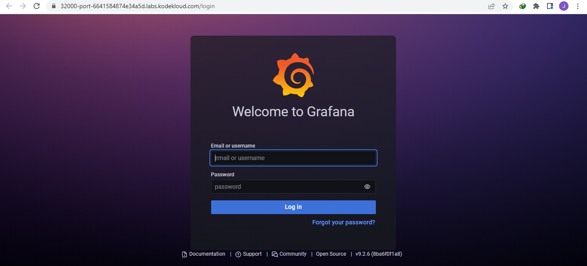

------------------------------

Start: &nbsp;&nbsp;&nbsp;&nbsp;&nbsp;&nbsp;&nbsp;&nbsp;2022-11-24 04:50:06  
Finished: &nbsp;&nbsp;2022-11-24 05:30:23

------------------------------

- [Requirements](#requirements)
- [Steps](#steps)
- [References](#references)

------------------------------

# TASK 61: Deploy Grafana on Kubernetes

## Requirements

The Nautilus DevOps teams is planning to set up a Grafana tool to collect and analyze analytics from some applications. They are planning to deploy it on Kubernetes cluster. Below you can find more details.

1.) Create a deployment named grafana-deployment-nautilus using any grafana image for Grafana app. Set other parameters as per your choice.

2.) Create NodePort type service with nodePort 32000 to expose the app.

You need not to make any configuration changes inside the Grafana app once deployed, just make sure you are able to access the Grafana login page.

Note: The kubeclt on jump_host has been configured to work with kubernetes cluster.

------------------------------

## Steps

Create the manifest for the deployment and service. We can put both resource definitions in a single file.


```bash
$ cat > grafana.yml

apiVersion: v1
kind: Service
metadata:
  name: grafana-deployment-nautilus
  labels:
    app: grafana
spec:
  type: NodePort
  ports:
    - port: 3000
      targetPort: 3000
      nodePort: 32000
      protocol: TCP
  selector:
    app: grafana
---
apiVersion: apps/v1
kind: Deployment
metadata:
  name: grafana-deployment-nautilus
  labels:
    app: grafana
spec:
  replicas: 1
  selector:
    matchLabels:
      app: grafana
  template:
    metadata:
      labels:
        app: grafana
    spec:
      containers:
      - name: grafana-container-nautilus
        image: grafana/grafana:latest
        imagePullPolicy: IfNotPresent
        ports:
        - containerPort: 3000
          name: http-grafana
        resources:
          requests:
            cpu: 500m
            memory: 1Gi
          # limits:
          #   cpu: “1000m”
          #   memory: “2Gi”
        volumeMounts:
        - mountPath: /var/lib/grafana
          name: grafana-pv
      volumes:
      - name: grafana-pv
        emptyDir: {}  
```

Apply the resources.

```bash
kubectl apply -f grafana.yml 
```

Check the Pods. It may take a few minutes for the Pod status to change from "ContainerCreating" to "Running".

```bash
$ kubectl get pods
NAME                                           READY   STATUS    RESTARTS   AGE
grafana-deployment-nautilus-577d958c47-pxpf5   1/1     Running   0          18s 
```

Click the "Grafana" button at the upper right to open a new tab which connects to the port defined in the manifest.

  

In the new tab, you should see the Grafana login page.

  


------------------------------

## References

- https://grafana.com/docs/grafana/latest/setup-grafana/installation/kubernetes/
- https://kodekloud.com/community/t/deploy-grafana-on-kubernetes-cluster-task-failed/24389
- https://kodekloud.com/community/t/grafana-in-kubernetes/14534