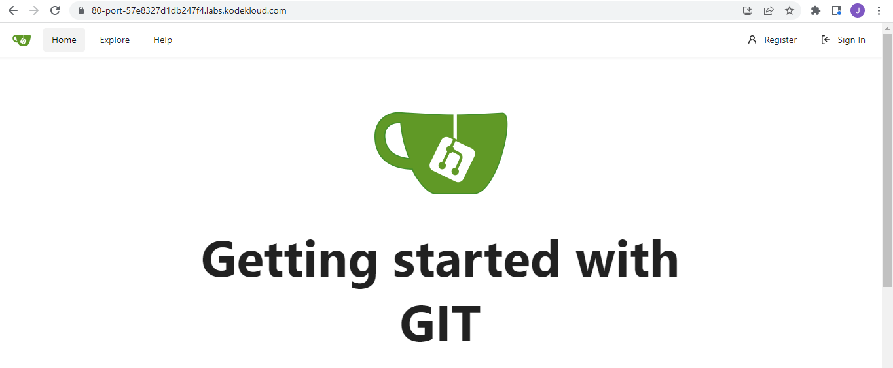
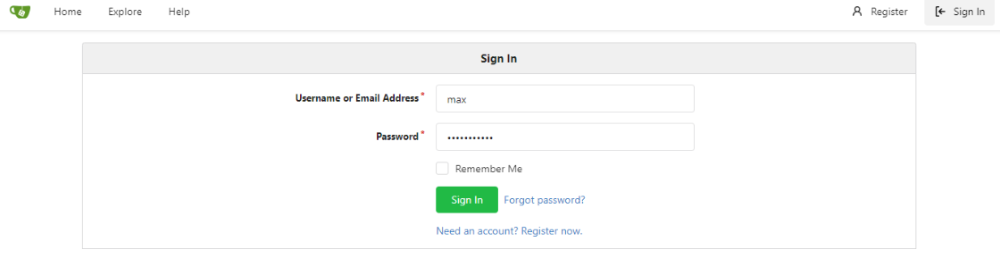
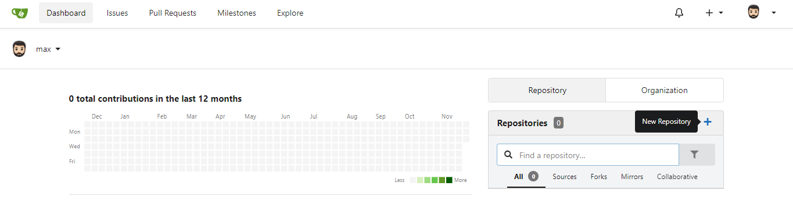
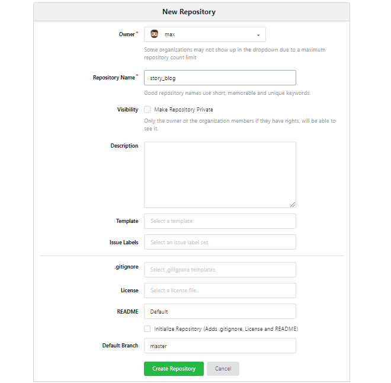
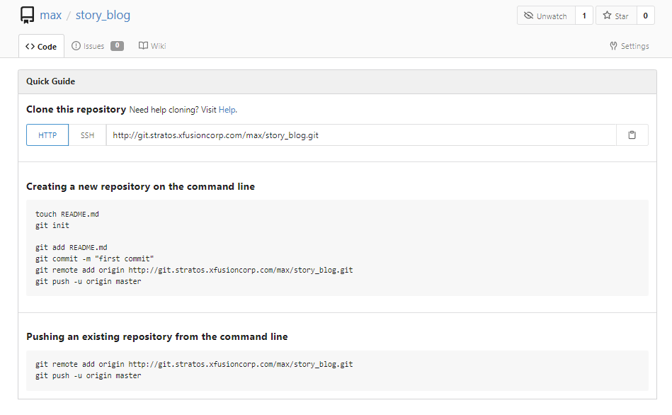
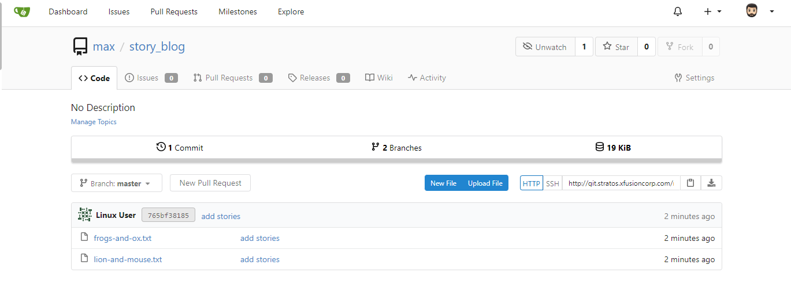
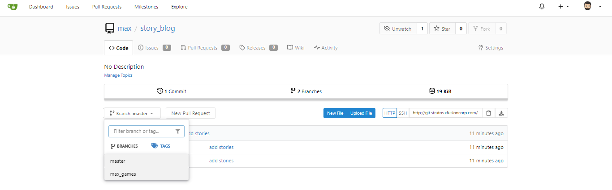
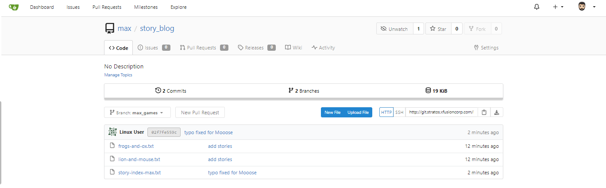

------------------------------

Start: &nbsp;&nbsp;&nbsp;&nbsp;&nbsp;&nbsp;&nbsp;&nbsp;2022-11-29 06:18:50  
Finished: &nbsp;&nbsp;2022-11-29 07:32:39

------------------------------

- [Requirements](#requirements)
- [Steps](#steps)
- [Resources](#resources)

------------------------------

# TASK 65: Manage Git Repositories

## Requirements

A new developer just joined the Nautilus development team and has been assigned a new project for which he needs to create a new repository under his account on Gitea server. Additionally, there is some existing data that need to be added to the repo. Below you can find more details about the task:

Click on the Gitea UI button on the top bar. You should be able to access the Gitea UI. Login to Gitea server using username **max** and password **Max_pass123**.

a. Create a new git repository **story_blog** under max user.

b. SSH into storage server using user **max** and password ******** and clone this newly created repository under user max home directory i.e /home/max.

c. Copy all files from location /usr/security to the repository and commit/push your changes to the master branch. The commit message must be "add stories" (must be done in single commit).

d. Create a new branch **max_demo** from master.

e. Copy a file story-index-max.txt from location /tmp/stories/ to the repository. This file has a typo, which you can fix by changing the word Mooose to Mouse. Commit and push the changes to the newly created branch. Commit message must be "typo fixed for Mooose" (must be done in single commit).

Note: For these kind of scenarios requiring changes to be done in a web UI, please take screenshots so that you can share it with us for review in case your task is marked incomplete. You may also consider using a screen recording software such as loom.com to record and share your work.

------------------------------

## Steps

Click the **Gitea UI** button at the upper right to open a new tab for the UI.

  

You should see the Gitea home page. 

<p align=center>

</p>

Click **sign in** and enter the provided credentials. Click **sign in** once again.

<p align=center>

</p>

In your dashboard, click the "+" at the right to create a new repository.

  

Put "story_blog" in the Repository Name field and then click **Create Repository** at the bottom.

<p align=center>

</p>

After creating the new repository, the page should now return a series of git commands. Copy the **HTTP** URL and save it in a notepad. We'll use it later.

<p align=center>

</p>

Back at the jumphost terminal, SSH to the storage server. Replace the '*******' with the user's password.

```bash
sshpass -p '*******' ssh -o StrictHostKeyChecking=no  max@172.16.238.15
```
Ensure you're in the user's home directory.
```bash
$ pwd 
/home/max  
```

If you're not in the user's home directory, go to it.

```bash
cd /home/max 
```

Clone the repo using the HTTP URL that you copied earlier. You should see the "Checking connectivity... done" message once successful.

```bash
max $ git clone  http://git.stratos.xfusioncorp.com/max/story_blog.git

Cloning into 'story_blog'...
warning: You appear to have cloned an empty repository.
Checking connectivity... done.
```
```bash
max $ ls -la
total 32
drwxr-sr-x    1 max      max           4096 Nov 28 23:22 .
drwxr-xr-x    1 root     root          4096 Oct 26  2020 ..
-rw-r--r--    1 max      max            202 Oct 26  2020 .bash_profile
-rw-r--r--    1 max      max            202 Oct 26  2020 .bashrc
-rw-r--r--    1 max      max             50 Oct 26  2020 .vimrc
drwxr-sr-x    3 max      max           4096 Nov 28 23:22 story_blog 
```

Check the files that needs to be copied from the specified directory.

```bash
max $ ls -la /usr/security/
total 20
drwxr-xr-x    2 max      max           4096 Nov 28 22:20 .
drwxr-xr-x    1 root     root          4096 Nov 28 22:20 ..
-rw-r--r--    1 max      max            792 Nov 28 22:20 frogs-and-ox.txt
-rw-r--r--    1 max      max           1086 Nov 28 22:20 lion-and-mouse.txt 
```

Copy them to the repository.

```bash
cp /usr/security/* ~/story_blog/ 
```

Verify.

```bash
max $ ls -la ~/story_blog/
total 24
drwxr-sr-x    3 max      max           4096 Nov 28 22:32 .
drwxr-sr-x    1 max      max           4096 Nov 28 22:27 ..
drwxr-sr-x    7 max      max           4096 Nov 28 22:27 .git
-rw-r--r--    1 max      max            792 Nov 28 22:32 frogs-and-ox.txt
-rw-r--r--    1 max      max           1086 Nov 28 22:32 lion-and-mouse.txt 
```

Go inside the repository and commit the new files using the provided commit message. Enter the username and password when prompted.

```bash
cd ~/story_blog 
```
```bash
max $ git add -A; git commit -m "add stories"; git push

Username for 'http://git.stratos.xfusioncorp.com': max 
Password for 'http://max@git.stratos.xfusioncorp.com':
```

You should see this output if commit was successful.

```bash
remote: . Processing 1 references
remote: Processed 1 references in total
To http://git.stratos.xfusioncorp.com/max/story_blog.git
 * [new branch]      master -> master 
```

Create a new branch and switch to it. You should see the prompt change from "max (master)" to "max (max_demo)".

```bash
max (master)$ git checkout -b max_demo
Switched to a new branch 'max_demo'

max (max_demo)$  
```

You could also verify that you're on the correct branch by running the command below. The branch with the '*' is the branch you're currently on.

```bash
max (max_demo)$ git branch

  master
* max_demo 
```

Check the file that needs to be copied from the specified directory. Copy it to the repository.

```bash
max (max_demo)$ ls -la  /tmp/stories/story-index-max.txt
-rw-r--r--    1 sarah    sarah          102 Nov 28 22:19 /tmp/stories/story-index-max.txt 
```
```bash
cp  /tmp/stories/story-index-max.txt ~/story_blog/ 
```

Verify that the file is copied to the repository.

```bash
max (max_demo)$ pwd
/home/max/story_blog

max (max_demo)$ ls -la
total 28
drwxr-sr-x    3 max      max           4096 Nov 28 22:39 .
drwxr-sr-x    1 max      max           4096 Nov 28 22:27 ..
drwxr-sr-x    8 max      max           4096 Nov 28 22:38 .git
-rw-r--r--    1 max      max            792 Nov 28 22:32 frogs-and-ox.txt
-rw-r--r--    1 max      max           1086 Nov 28 22:32 lion-and-mouse.txt
-rw-r--r--    1 max      max            102 Nov 28 22:39 story-index-max.txt
```

Edit the "story-index-max.txt" using vim and replace "Mooose" with "Mouse".

```bash
max (max_demo)$ vim story-index-max.txt

1. The Lion and the Mooose
2. The Frogs and the Ox
3. The Fox and the Grapes
4. The Donkey and the Dog 
```
```bash
1. The Lion and the Mouse
2. The Frogs and the Ox
3. The Fox and the Grapes
4. The Donkey and the Dog 
```

Check the status to confirm that we have a new file added to the repository. It is also best practice to check the status before staging any changes to ensure we're only staging the correct ones.

```bash
max (max_demo)$ git status

On branch max_demo
Untracked files:
  (use "git add <file>..." to include in what will be committed)

        story-index-max.txt

nothing added to commit but untracked files present (use "git add" to track) 
```

Stage and commit the change with the correct commit message. This can be done in a single line of command, along with the "git push". 

Make sure to specify "origin" as the origin branch and "max_demo" as the remote branch in the push command.

```bash
max (max_demo)$ git add story-index-max.txt; git commit -m "typo fixed for Mooose"; git push origin max_demo

remote: . Processing 1 references
remote: Processed 1 references in total
To http://git.stratos.xfusioncorp.com/max/story_blog.git
 * [new branch]      max_demo -> max_demo
```

Back at the Gitea UI, click **story_blog** to see your dashboard. By default, the master branch will be displayed. You should see the two files you commited earlier along with the "add stories" commit message.

  

Switch to the **max_demo** branch.

  

You should see the new file added and the commit message.

  

------------------------------

## Resources