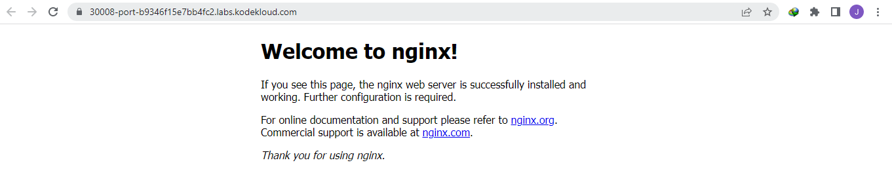

------------------------------

Start: &nbsp;&nbsp;&nbsp;&nbsp;&nbsp;&nbsp;&nbsp;&nbsp;2023-03-19 05:08:57  
Finished: &nbsp;&nbsp;2023-03-19 06:16:44     

Start: &nbsp;&nbsp;&nbsp;&nbsp;&nbsp;&nbsp;&nbsp;&nbsp;2023-03-20 04:25:42  
Finished: &nbsp;&nbsp;2023-03-20 04:37:23

> *Requested for Kodekloud admins to review the lab, and I was able to redo it, hence the two Start and Finished time.*

------------------------------

- [Requirements](#requirements)
- [Steps](#steps)
- [Resources](#resources)

------------------------------

# TASK 108: Persistent Volumes in Kubernetes

## Requirements

The Nautilus DevOps team is working on a Kubernetes template to deploy a web application on the cluster. There are some requirements to create/use persistent volumes to store the application code, and the template needs to be designed accordingly. Please find more details below:

Create a PersistentVolume named as **pv-datacenter**. Configure the **spec** as storage class should be **manual**, set capacity to **4Gi**, set access mode to **ReadWriteOnce**, volume type should be hostPath and set path to **/mnt/data** (this directory is already created, you might not be able to access it directly, so you need not to worry about it).

Create a PersistentVolumeClaim named as **pvc-datacenter**. Configure the spec as storage class should be **manual**, request **2Gi** of the storage, set access mode to **ReadWriteOnce**.

Create a pod named as **pod-datacenter**, mount the persistent volume you created with claim name **pvc-datacenter** at document root of the web server, the container within the pod should be named as **container-datacenter** using image **nginx** with latest tag only (remember to mention the tag i.e nginx:latest).

Create a **node port type** service named **web-datacenter** using node port **30008** to expose the web server running within the pod.

Note: The kubectl utility on jump_host has been configured to work with the kubernetes cluster.

------------------------------

## Steps

Create the **app.yml** for the resource definitions.

Note:

- If image is httpd, document root is "/var/www/html"
- If image is nginx, document root is "/usr/share/nginx/html"

```yaml
---
apiVersion: v1
kind: PersistentVolume
metadata:
  name: pv-datacenter
spec:
  storageClassName: manual
  capacity:
    storage: 4Gi
  accessModes:
    - ReadWriteOnce
  hostPath:
    path: /mnt/data
    type: ""
---
apiVersion: v1
kind: PersistentVolumeClaim
metadata:
  name: pvc-datacenter
spec:
  storageClassName: manual
  accessModes:
    - ReadWriteOnce
  resources:
    requests:
      storage: 2Gi
---
apiVersion: v1
kind: Pod
metadata:
  name: pod-datacenter
  labels: 
    app: datacenter
spec:
  containers:
    - name: container-datacenter
      image: nginx:latest
      volumeMounts:
        - name: data
          mountPath: /usr/share/nginx/html
  volumes:
    - name: data
      persistentVolumeClaim:
        claimName: pvc-datacenter
---
apiVersion: v1
kind: Service
metadata:
  name: web-datacenter
spec:
  type: NodePort
  selector:
    app: datacenter
  ports:
    - name: http
      port: 80
      targetPort: 80
      nodePort: 30008
```
           
Apply. 

```bash
$ kubectl apply -f app.yml
persistentvolume/pv-datacenter created
persistentvolumeclaim/pvc-datacenter created
pod/pod-datacenter created
service/web-datacenter created
```

Check the resources.

```bash
$ kubectl get all
NAME                 READY   STATUS    RESTARTS   AGE
pod/pod-datacenter   1/1     Running   0          18s

NAME                     TYPE        CLUSTER-IP    EXTERNAL-IP   PORT(S)        AGE
service/kubernetes       ClusterIP   10.96.0.1     <none>        443/TCP        54m
service/web-datacenter   NodePort    10.96.2.209   <none>        80:30008/TCP   18s
```
```bash
$ kubectl get pv
NAME            CAPACITY   ACCESS MODES   RECLAIM POLICY   STATUS   CLAIM                    STORAGECLASS   REASON   AGE
pv-datacenter   4Gi        RWO            Retain           Bound    default/pvc-datacenter   manual                  36s 
```
```bash
$ kubectl get pvc
NAME             STATUS   VOLUME          CAPACITY   ACCESS MODES   STORAGECLASS   AGE
pvc-datacenter   Bound    pv-datacenter   4Gi        RWO            manual         50s
```

```bash
$ kubectl logs pod/pod-datacenter
/docker-entrypoint.sh: /docker-entrypoint.d/ is not empty, will attempt to perform configuration
/docker-entrypoint.sh: Looking for shell scripts in /docker-entrypoint.d/
/docker-entrypoint.sh: Launching /docker-entrypoint.d/10-listen-on-ipv6-by-default.sh
10-listen-on-ipv6-by-default.sh: info: Getting the checksum of /etc/nginx/conf.d/default.conf
10-listen-on-ipv6-by-default.sh: info: Enabled listen on IPv6 in /etc/nginx/conf.d/default.conf
/docker-entrypoint.sh: Launching /docker-entrypoint.d/20-envsubst-on-templates.sh
/docker-entrypoint.sh: Launching /docker-entrypoint.d/30-tune-worker-processes.sh
/docker-entrypoint.sh: Configuration complete; ready for start up
2023/03/19 20:30:45 [notice] 1#1: using the "epoll" event method
2023/03/19 20:30:45 [notice] 1#1: nginx/1.23.3
2023/03/19 20:30:45 [notice] 1#1: built by gcc 10.2.1 20210110 (Debian 10.2.1-6) 
2023/03/19 20:30:45 [notice] 1#1: OS: Linux 5.4.0-1101-gcp
2023/03/19 20:30:45 [notice] 1#1: getrlimit(RLIMIT_NOFILE): 1048576:1048576
```

To verify, click the "Website" button at the upper left. It should open a new tab with the NGINX landing page.




------------------------------

## Resources

- https://kubernetes.io/docs/concepts/services-networking/service/#defining-a-service
- https://kodekloud.com/community/t/persistent-volumes-in-kubernetes-task-failed/11877/4