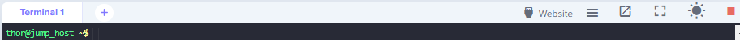
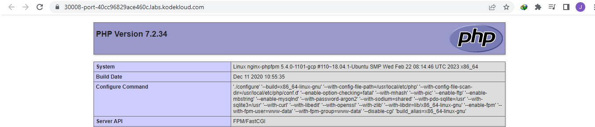

------------------------------

Start: &nbsp;&nbsp;&nbsp;&nbsp;&nbsp;&nbsp;&nbsp;&nbsp;2023-03-28 06:56:36  
Finished: &nbsp;&nbsp;2023-03-28 07:32:29

------------------------------

- [Requirements](#requirements)
- [Steps](#steps)
- [Resources](#resources)

------------------------------

# TASK 111: Fix Issue with VolumeMounts in Kubernetes

## Requirements

We deployed a Nginx and PHPFPM based setup on Kubernetes cluster last week and it had been working fine. This morning one of the team members made a change somewhere which caused some issues, and it stopped working. Please look into the issue and fix it:

- The pod name is **nginx-phpfpm** and configmap name is **nginx-config**. Figure out the issue and fix the same.

- Once issue is fixed, copy **/home/thor/index.php** file from jump host into **nginx-container** under nginx document root and you should be able to access the website using Website button on top bar.

Note: The kubectl utility on jump_host has been configured to work with the kubernetes cluster.

------------------------------

## Steps

Check the resources.

```bash
$ kubectl get all 

NAME               READY   STATUS    RESTARTS   AGE
pod/nginx-phpfpm   2/2     Running   0          2m

NAME                    TYPE        CLUSTER-IP     EXTERNAL-IP   PORT(S)          AGE
service/kubernetes      ClusterIP   10.96.0.1      <none>        443/TCP          177m
service/nginx-service   NodePort    10.96.45.246   <none>        8099:30008/TCP   119s
```

Since the Pod uses a ConfigMap, most likely there's a conflict between the Pod definition and ConfigMap that it uses. Generate the YAML file from the running pod and carefully review it.

```bash
kubectl get pod/nginx-phpfpm -o yaml > pod.yml 
```

Also generate the YAML file from the ConfigMap and compare with the pod YAML file.

```bash
kubectl get cm nginx-config -o yaml > pod-cm.yml  
```

In the ConfigMap, we see that it uses the "/var/www/html" as root directory.

```bash
$ cat pod-cm.yml
....

    # Set nginx to serve files from the shared volume!
    root /var/www/html;
    index  index.html index.htm index.php;
```

However, if we check the Pod definition, the two containers inside the Pod uses different **mountPath** for the **shared-files**.

To fix this, change all occurence of "/usr/share/nginx/html" to "/var/www/html".

```bash
$ cat pod.yml

spec:
  containers:
  - image: php:7.2-fpm
    imagePullPolicy: IfNotPresent
    name: php-fpm-container
    resources: {}
    terminationMessagePath: /dev/termination-log
    terminationMessagePolicy: File
    volumeMounts:
    - mountPath: /var/www/html
      name: shared-files
    - mountPath: /var/run/secrets/kubernetes.io/serviceaccount
      name: default-token-cv4x8
      readOnly: true

  - image: nginx:latest
    imagePullPolicy: Always
    name: nginx-container
    resources: {}
    terminationMessagePath: /dev/termination-log
    terminationMessagePolicy: File
    volumeMounts:
    - mountPath: /usr/share/nginx/html
      name: shared-files
    - mountPath: /etc/nginx/nginx.conf
      name: nginx-config-volume
      subPath: nginx.conf
    - mountPath: /var/run/secrets/kubernetes.io/serviceaccount
      name: default-token-cv4x8
      readOnly: true  
```

Replace the running Pod definition with the new one. Verify.

```bash
$  kubectl replace -f pod.yml --force

pod "nginx-phpfpm" deleted
pod/nginx-phpfpm replaced  
```
```bash
$ kubectl get pod

NAME           READY   STATUS    RESTARTS   AGE
nginx-phpfpm   2/2     Running   0          22s 
```
```bash
$ kubectl logs -f nginx-phpfpm
error: a container name must be specified for pod nginx-phpfpm, choose one of: [php-fpm-container nginx-container]

$ kubectl logs -f nginx-phpfpm php-fpm-container
[27-Mar-2023 23:21:39] NOTICE: fpm is running, pid 1
[27-Mar-2023 23:21:39] NOTICE: ready to handle connections 

$ kubectl logs -f nginx-phpfpm nginx-container
/docker-entrypoint.sh: /docker-entrypoint.d/ is not empty, will attempt to perform configuration
/docker-entrypoint.sh: Looking for shell scripts in /docker-entrypoint.d/
/docker-entrypoint.sh: Launching /docker-entrypoint.d/10-listen-on-ipv6-by-default.sh
10-listen-on-ipv6-by-default.sh: info: Getting the checksum of /etc/nginx/conf.d/default.conf
10-listen-on-ipv6-by-default.sh: info: Enabled listen on IPv6 in /etc/nginx/conf.d/default.conf
/docker-entrypoint.sh: Launching /docker-entrypoint.d/20-envsubst-on-templates.sh
/docker-entrypoint.sh: Launching /docker-entrypoint.d/30-tune-worker-processes.sh
/docker-entrypoint.sh: Configuration complete; ready for start up
```

Next, copy the **/home/thor/index.php** onto the root directory in the container.

```bash
kubectl cp  /home/thor/index.php  nginx-phpfpm:/var/www/html -c nginx-container  
```

Now click the **Website** button at the upper right. It should open a new tab that shows the landing page of the PHP application.





------------------------------

## Resources

- https://kodekloud.com/community/t/problem-with-task-fix-issue-with-volumemounts-in-kubernetes/15973/8

- https://www.nbtechsupport.co.in/2021/04/volumemounts-in-kubernetes.html?m=1
