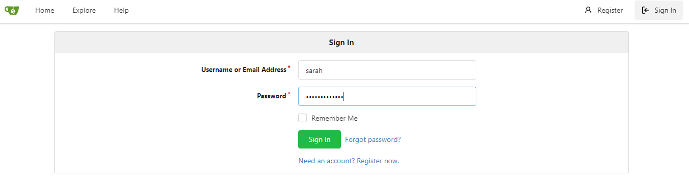
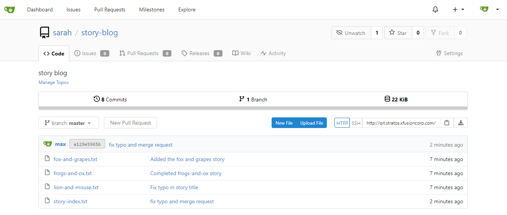

------------------------------

Start: &nbsp;&nbsp;&nbsp;&nbsp;&nbsp;&nbsp;&nbsp;&nbsp;2022-12-22 19:57:05  
Finished: &nbsp;&nbsp;2023-04-11 21:40:00

------------------------------

- [Requirements](#requirements)
- [Steps](#steps)
- [Resources](#resources)

------------------------------

# TASK 114: Resolve Git Merge Conflicts

## Requirements

Sarah and Max were working on writting some stories which they have pushed to the repository. Max has recently added some new changes and is trying to push them to the repository but he is facing some issues. Below you can find more details:

- SSH into storage server using user max and password Max_pass123. Under /home/max you will find the **story-blog** repository. Try to push the changes to the origin repo and fix the issues. The story-index.txt must have titles for all 4 stories. Additionally, there is a typo in **The Lion and the Mooose** line where Mooose should be **Mouse**.

- Click on the Gitea UI button on the top bar. You should be able to access the Gitea page. You can login to Gitea server from UI using username sarah and password Sarah_pass123 or username max and password Max_pass123.

Note: For these kind of scenarios requiring changes to be done in a web UI, please take screenshots so that you can share it with us for review in case your task is marked incomplete. You may also consider using a screen recording software such as loom.com to record and share your work.


------------------------------

## Steps

Login to the storage server.

```bash
sshpass -p 'Max_pass123' ssh -o StrictHostKeyChecking=no  max@172.16.238.15
sudo su -
Bl@kW 
```

Proceed to the specified directory and check the files.

```bash
max $ cd /home/max/story-blog/
max (master)$   
max (master)$ ls -la
total 32
drwxr-sr-x    3 max      max           4096 Apr 11 13:14 .
drwxr-sr-x    1 max      max           4096 Apr 11 13:14 ..
drwxr-sr-x    8 max      max           4096 Apr 11 13:14 .git
-rw-r--r--    1 max      max            807 Apr 11 13:14 fox-and-grapes.txt
-rw-r--r--    1 max      max            792 Apr 11 13:14 frogs-and-ox.txt
-rw-r--r--    1 max      max           1086 Apr 11 13:14 lion-and-mouse.txt
-rw-r--r--    1 max      max            102 Apr 11 13:14 story-index.txt
```

If we try to push, we'll get an error. 

```bash
max (master)$ git push

Username for 'http://git.stratos.xfusioncorp.com': max
Password for 'http://max@git.stratos.xfusioncorp.com': 
To http://git.stratos.xfusioncorp.com/sarah/story-blog.git
 ! [rejected]        master -> master (fetch first)
error: failed to push some refs to 'http://git.stratos.xfusioncorp.com/sarah/story-blog.git'
hint: Updates were rejected because the remote contains work that you do
hint: not have locally. This is usually caused by another repository pushing
hint: to the same ref. You may want to first integrate the remote changes
hint: (e.g., 'git pull ...') before pushing again.
hint: See the 'Note about fast-forwards' in 'git push --help' for details. 
```

The same thing happens if we try to do a pull.

```bash
max (master)$ git pull origin master
remote: Enumerating objects: 4, done.
remote: Counting objects: 100% (4/4), done.
remote: Compressing objects: 100% (3/3), done.
remote: Total 3 (delta 0), reused 0 (delta 0), pack-reused 0
Unpacking objects: 100% (3/3), done.
From http://git.stratos.xfusioncorp.com/sarah/story-blog
 * branch            master     -> FETCH_HEAD
   ab9032f..a092f86  master     -> origin/master
Auto-merging story-index.txt
CONFLICT (add/add): Merge conflict in story-index.txt
Automatic merge failed; fix conflicts and then commit the result. 
```

Modify the file and fix the error as indicated in the instructions.

```bash
max (master)$ vi story-index.txt
max (master)$ cat story-index.txt 
1. The Lion and the Mouse
2. The Frogs and the Ox
3. The Fox and the Grapes
4. The Donkey and the Dog
```

Add, commit, and push it. The check status.

```bash
git add story-index.txt 
git commit -m "fix typo and merge request"
git push origin master
```
```bash
max (master)$ git status
On branch master
Your branch is up-to-date with 'origin/master'.
nothing to commit, working directory clean 
```

To verify, click the "Gitea UI" at the top right to open a new tab. Login in the UI.
Check the **story-blog** to confirm the commit.







------------------------------

## Resources