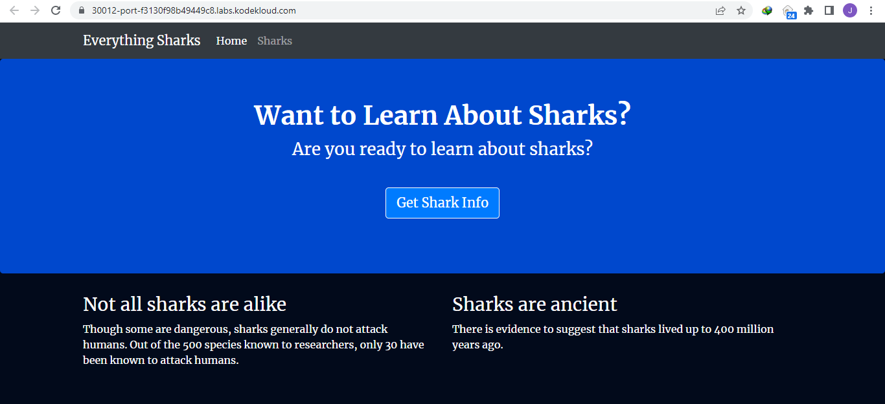

------------------------------

Start: &nbsp;&nbsp;&nbsp;&nbsp;&nbsp;&nbsp;&nbsp;&nbsp;2023-04-30 09:14:43   
Finished: &nbsp;&nbsp;2023-04-30 09:30:06  

------------------------------

- [Requirements](#requirements)
- [Steps](#steps)
- [Resources](#resources)

------------------------------

# TASK 118: Deploy Node App on Kubernetes

## Requirements

The Nautilus development team has completed development of one of the node applications, which they are planning to deploy on a Kubernetes cluster. They recently had a meeting with the DevOps team to share their requirements. Based on that, the DevOps team has listed out the exact requirements to deploy the app. Find below more details:

- Create a deployment using gcr.io/kodekloud/centos-ssh-enabled:node image, replica count must be 2.

- Create a service to expose this app, the service type must be NodePort, targetPort must be 8080 and nodePort should be 30012.

- Make sure all the pods are in Running state after the deployment.

- You can check the application by clicking on NodeApp button on top bar.

- You can use any labels as per your choice.

Note: The kubectl on jump_host has been configured to work with the kubernetes cluster.

------------------------------

## Steps

Create the **deploy-node.yml** file.

```bash
apiVersion: apps/v1
kind: Deployment
metadata:
  name: node-deployment
  namespace: default
spec:
  replicas: 2
  selector:
    matchLabels:
      app: node-app
  template:
    metadata:
      labels:
        app: node-app
    spec:
      containers:
        - name: node-container
          image: gcr.io/kodekloud/centos-ssh-enabled:node
          ports:
            - containerPort: 80
---
apiVersion: v1
kind: Service
metadata:
  name: node-service
  namespace: default
spec:
  type: NodePort
  selector:
    app: node-app
  ports:
    - port: 80
      targetPort: 8080
      nodePort: 30012
```

Apply. 

```bash
kubectl apply -f deploy-node.yml
```

Check the resources.

```bash
$ kubectl get pods
NAME                              READY   STATUS    RESTARTS   AGE
node-deployment-dd99d7b78-r5d7z   1/1     Running   0          58s
node-deployment-dd99d7b78-td856   1/1     Running   0          58s  
```
```bash
$ kubectl get svc
NAME           TYPE        CLUSTER-IP     EXTERNAL-IP   PORT(S)        AGE
kubernetes     ClusterIP   10.96.0.1      <none>        443/TCP        122m
node-service   NodePort    10.96.82.135   <none>        80:30012/TCP   76s 
```

Click the "NodeApp" button at the top right. It should open a new tab with the landing page.




------------------------------

## Resources