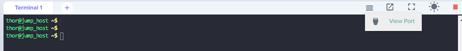
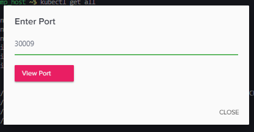
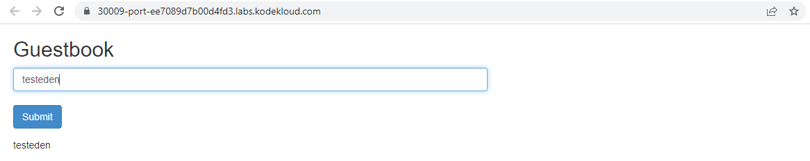

------------------------------

Start: &nbsp;&nbsp;&nbsp;&nbsp;&nbsp;&nbsp;&nbsp;&nbsp;2023-06-03 23:06:53  
Finished: &nbsp;&nbsp;2023-06-03 23:29:48   

------------------------------

- [Requirements](#requirements)
- [Steps](#steps)
- [Resources](#resources)

------------------------------

# TASK 128: Deploy Guest Book App on Kubernetes	

## Requirements

The Nautilus Application development team has finished development of one of the applications and it is ready for deployment. It is a guestbook application that will be used to manage entries for guests/visitors. As per discussion with the DevOps team, they have finalized the infrastructure that will be deployed on Kubernetes cluster. Below you can find more details about it.


**BACK-END TIER**

Create a deployment named **redis-master** for Redis master.

- Replicas count should be **1**.

- Container name should be **master-redis-devops** and it should use image **redis**.

- Request resources as CPU should be **100m** and Memory should be **100Mi**.

- Container port should be redis default port i.e **6379**.

Create a service named **redis-master** for Redis master. Port and targetPort should be Redis default port i.e **6379**.

Create another deployment named **redis-slave** for Redis slave.

- Replicas count should be **2**.

- Container name should be **slave-redis-devops** and it should use **gcr.io/google_samples/gb-redisslave:v3** image.

- Requests resources as CPU should be **100m** and Memory should be **100Mi**.

- Define an environment variable named **GET_HOSTS_FROM** and its value should be dns.

- Container port should be Redis default port i.e 6379.

Create another service named **redis-slave**. It should use Redis default port i.e 6379.

**FRONT END TIER**

Create a deployment named **frontend**.

- Replicas count should be **3**.

- Container name should be **php-redis-devops** and it should use **gcr.io/google-samples/gb-frontend:v4 image.**

- Request resources as CPU should be **100m** and Memory should be **100Mi**.

- Define an environment variable named as **GET_HOSTS_FROM** and its value should be dns.

- Container port should be **80**.

Create a service named **frontend**. Its type should be **NodePort**, port should be **80** and its nodePort should be **30009**.

Finally, you can check the guestbook app by clicking on + button in the top left corner and Select port to view on Host 1 then enter your nodePort.

You can use any labels as per your choice.

Note: The kubectl utility on jump_host has been configured to work with the kubernetes cluster.

------------------------------

## Steps

Create **guest-app.yml** based on the requirements.

```yaml
apiVersion: apps/v1
kind: Deployment
metadata:
  name: redis-master
  labels:
    app: redis
spec:
  replicas: 1
  selector:
    matchLabels:
      app: redis
  template:
    metadata:
      labels:
        app: redis
    spec:
      containers:
      - name: master-redis-devops
        image: redis
        ports:
        - containerPort: 6379
        resources:
          requests:
            memory: "100Mi"
            cpu: "100m"
---
apiVersion: v1
kind: Service
metadata:
  name: redis-master
spec:
  selector:
    app: redis
  ports:
    - protocol: TCP
      port: 6379
      targetPort: 6379
---
apiVersion: apps/v1
kind: Deployment
metadata:
  name: redis-slave
  labels:
    app: redis-slave
spec:
  replicas: 2
  selector:
    matchLabels:
      app: redis-slave
  template:
    metadata:
      labels:
        app: redis-slave
    spec:
      containers:
      - name: slave-redis-devops
        image: gcr.io/google_samples/gb-redisslave:v3
        ports:
        - containerPort: 6379
        resources:
          requests:
            memory: "100Mi"
            cpu: "100m"
        env:
        - name: GET_HOSTS_FROM
          value: "dns"
---
apiVersion: v1
kind: Service
metadata:
  name: redis-slave
spec:
  selector:
    app: redis-slave
  ports:
    - protocol: TCP
      port: 6379
      targetPort: 6379
---
apiVersion: apps/v1
kind: Deployment
metadata:
  name: frontend
  labels:
    app: frontend
spec:
  replicas: 3
  selector:
    matchLabels:
      app: frontend
  template:
    metadata:
      labels:
        app: frontend
    spec:
      containers:
      - name: php-redis-devops
        image: gcr.io/google-samples/gb-frontend:v4
        ports:
        - containerPort: 80
        resources:
          requests:
            memory: "100Mi"
            cpu: "100m"
        env:
        - name: GET_HOSTS_FROM
          value: "dns"
---
apiVersion: v1
kind: Service
metadata:
  name: frontend
spec:
  type: NodePort
  selector:
    app: frontend
  ports:
    - protocol: TCP
      port: 80
      targetPort: 80
      nodePort: 30009
```

Apply. 

```bash
kubectl apply -f guest-app.yml
```

Check the resources.

```bash
thor@jump_host ~$ kubectl get all
NAME                                READY   STATUS    RESTARTS   AGE
pod/frontend-7fd46b6847-84572       1/1     Running   0          116s
pod/frontend-7fd46b6847-gjsst       1/1     Running   0          116s
pod/frontend-7fd46b6847-s2q9h       1/1     Running   0          116s
pod/redis-master-5594594987-fpm55   1/1     Running   0          117s
pod/redis-slave-bf445dc75-5hvpp     1/1     Running   0          117s
pod/redis-slave-bf445dc75-rl8mm     1/1     Running   0          117s

NAME                   TYPE        CLUSTER-IP      EXTERNAL-IP   PORT(S)        AGE
service/frontend       NodePort    10.96.160.197   <none>        80:30009/TCP   116s
service/kubernetes     ClusterIP   10.96.0.1       <none>        443/TCP        92m
service/redis-master   ClusterIP   10.96.101.14    <none>        6379/TCP       117s
service/redis-slave    ClusterIP   10.96.228.47    <none>        6379/TCP       117s

NAME                           READY   UP-TO-DATE   AVAILABLE   AGE
deployment.apps/frontend       3/3     3            3           117s
deployment.apps/redis-master   1/1     1            1           117s
deployment.apps/redis-slave    2/2     2            2           117s

NAME                                      DESIRED   CURRENT   READY   AGE
replicaset.apps/frontend-7fd46b6847       3         3         3       117s
replicaset.apps/redis-master-5594594987   1         1         1       117s
replicaset.apps/redis-slave-bf445dc75     2         2         2       117s  
```

To verify, click the hamburger button and click View port. In the pop-up window, change port 80 to 30009 and click View port. It should open a new tab.





We can see the guest app in the next page. Type any text in the field and click Submit. The text should appear just below the field.




------------------------------

## Resources

- https://www.shawonruet.com/2021/12/deploy-node-app-on-kubernetes-kodekloud.html
- https://kodekloud.com/community/t/deploy-guest-book-app-on-kubernetes/21133/3