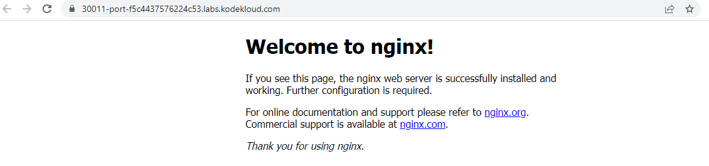

------------------------------

Start: &nbsp;&nbsp;&nbsp;&nbsp;&nbsp;&nbsp;&nbsp;&nbsp;2023-06-09 23:23:11  
Finished: &nbsp;&nbsp;2023-06-09 23:30:24

------------------------------

- [Requirements](#requirements)
- [Steps](#steps)
- [Resources](#resources)

------------------------------

# TASK 131: Deploy Nginx Web Server on Kubernetes Cluster

## Requirements

Some of the Nautilus team developers are developing a static website and they want to deploy it on Kubernetes cluster. They want it to be highly available and scalable. Therefore, based on the requirements, the DevOps team has decided to create a deployment for it with multiple replicas. Below you can find more details about it:

- Create a deployment using **nginx** image with **latest** tag only and remember to mention the tag i.e nginx:latest. Name it as **nginx-deployment**. The container should be named as **nginx-container**, also make sure **replica counts are 3**.

- Create a **NodePort** type service named **nginx-service**. The nodePort should be **30011**.

Note: The kubectl utility on jump_host has been configured to work with the kubernetes cluster.

------------------------------

## Steps

Check all the resources first.

```bash
kubectl get all 
```

Create the **nginx.yml** based on the requirements.

```yaml
apiVersion: v1
kind: Service
metadata:
  name: nginx-service
spec:
  type: NodePort
  selector:
    app: nginx-app
    type: front-end
  ports:
    - port: 80
      targetPort: 80
      nodePort: 30011
---
apiVersion: apps/v1
kind: Deployment
metadata:
  name: nginx-deployment
  labels:
    app: nginx-app
    type: front-end
spec:
  replicas: 3
  selector:
    matchLabels:
      app: nginx-app
      type: front-end
  template:
    metadata:
      labels:
        app: nginx-app
        type: front-end
    spec:
      containers:
        - name: nginx-container
          image: nginx:latest  
```

Apply. 

```bash
kubectl apply -f nginx.yml
```

Check the resources again.

```bash
$ kubectl get all

NAME                                    READY   STATUS    RESTARTS   AGE
pod/nginx-deployment-56cbd5d774-7vbk5   1/1     Running   0          39s
pod/nginx-deployment-56cbd5d774-gmgl8   1/1     Running   0          39s
pod/nginx-deployment-56cbd5d774-kt5pt   1/1     Running   0          39s

NAME                    TYPE        CLUSTER-IP    EXTERNAL-IP   PORT(S)        AGE
service/kubernetes      ClusterIP   10.96.0.1     <none>        443/TCP        112m
service/nginx-service   NodePort    10.96.8.253   <none>        80:30011/TCP   39s

NAME                               READY   UP-TO-DATE   AVAILABLE   AGE
deployment.apps/nginx-deployment   3/3     3            3           39s

NAME                                          DESIRED   CURRENT   READY   AGE
replicaset.apps/nginx-deployment-56cbd5d774   3         3         3       39s  
```

To test this, click the **App** button at the upper right. This will open a new tab with the NGINX landing page.





------------------------------

## Resources