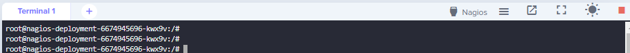
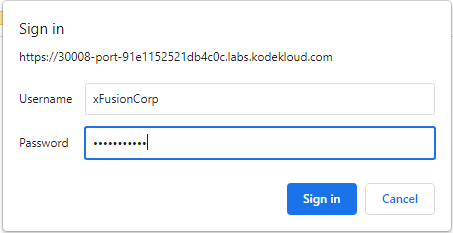
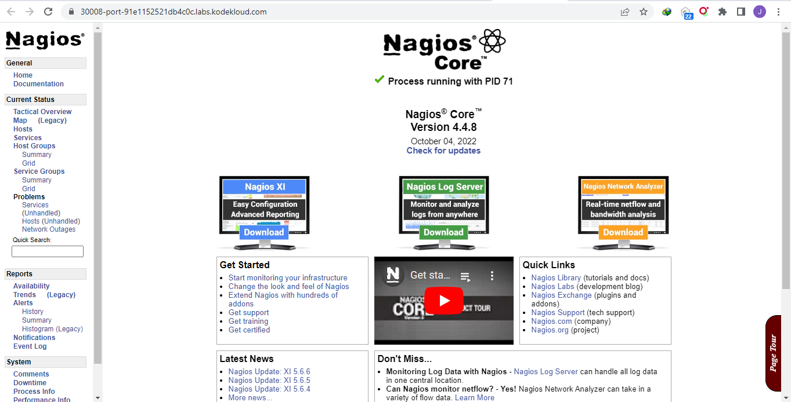

------------------------------

Start: &nbsp;&nbsp;&nbsp;&nbsp;&nbsp;&nbsp;&nbsp;&nbsp;2023-06-22 03:35:55  
Finished: &nbsp;&nbsp;2023-06-22 03:48:25

------------------------------

- [Requirements](#requirements)
- [Steps](#steps)
- [Resources](#resources)

------------------------------

# TASK 134: Deploy Nagios on Kubernetes

## Requirements

The Nautilus DevOps team is planning to set up a Nagios monitoring tool to monitor some applications, services etc. They are planning to deploy it on Kubernetes cluster. Below you can find more details.

1) Create a deployment **nagios-deployment** for Nagios core. The container name must be **nagios-container** and it must use **jasonrivers/nagios** image.

2) Create a user and password for the Nagios core web interface, user must be **xFusionCorp** and password must be **LQfKeWWxWD**. (you can manually perform this step after deployment)

3) Create a service **nagios-service** for Nagios, which must be of **targetPort** type. **nodePort** must be **30008**.

You can use any labels as per your choice.

Note: The kubectl on jump_host has been configured to work with the kubernetes cluster.

------------------------------

## Steps

Create the **deploy.yml** based on the requirements.

```yaml
apiVersion: apps/v1
kind: Deployment
metadata:
  name: nagios-deployment
spec:
  replicas: 1
  selector:
    matchLabels:
      app: nagios-core
  template:
    metadata:
      labels:
        app: nagios-core
    spec:
      containers:
        - name: nagios-container
          image: jasonrivers/nagios
---
apiVersion: v1
kind: Service
metadata:
  name: nagios-service
spec:
  type: NodePort
  selector:
    app: nagios-core
  ports:
    - port: 80
      targetPort: 80
      nodePort: 30008          
```

Apply. 

```bash
kubectl apply -f .
```

Verify.

```bash
thor@jump_host ~$ kubectl get pods
NAME                                 READY   STATUS    RESTARTS   AGE
nagios-deployment-6674945696-kwx9v   1/1     Running   0          59s

thor@jump_host ~$ kubectl get svc
NAME             TYPE        CLUSTER-IP     EXTERNAL-IP   PORT(S)        AGE
kubernetes       ClusterIP   10.96.0.1      <none>        443/TCP        14m
nagios-service   NodePort    10.96.26.162   <none>        80:30008/TCP   65s 
```

Open a shell on the pod to create the username and password.

```bash
kubectl exec -it nagios-deployment-6674945696-kwx9v /bin/bash 
```
```bash
root@nagios-deployment-6674945696-kwx9v:/# htpasswd /opt/nagios/etc/htpasswd.users xFusionCorp

New password: 
Re-type new password: 
Adding password for user xFusionCorp  
```

To verify the deployment, click the **Nagios** button.



In the pop-up window, enter the username and password.






------------------------------

## Resources