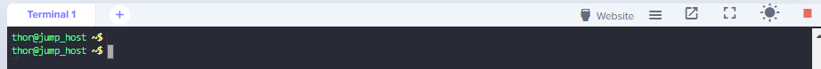

------------------------------

Start: &nbsp;&nbsp;&nbsp;&nbsp;&nbsp;&nbsp;&nbsp;&nbsp;2023-07-02 14:19:58     
Finished: &nbsp;&nbsp;2023-07-02 14:30:07   

------------------------------

- [Requirements](#requirements)
- [Steps](#steps)
- [Resources](#resources)

------------------------------

# TASK 142: Deploy Apache Web Server on Kubernetes Cluster

## Requirements

There is an application that needs to be deployed on Kubernetes cluster under Apache web server. The Nautilus application development team has asked the DevOps team to deploy it. We need to develop a template as per requirements mentioned below:

- Create a namespace named as **httpd-namespace-nautilus**.

- Create a deployment named as **httpd-deployment-nautilus** under newly created namespace. For the deployment use **httpd** image with **latest** tag only and remember to mention the tag i.e httpd:latest, and make sure **replica counts are 2**.

- Create a service named as **httpd-service-nautilus** under same namespace to expose the deployment, nodePort should be **30004**.

Note: The kubectl utility on jump_host has been configured to work with the kubernetes cluster.

------------------------------

## Steps

Create the **deploy.yml** which should create the namespace, deployment, and service according to the requirements. 

```yaml
## deploy.yaml
---
apiVersion: v1
kind: Namespace
metadata:
  name: httpd-namespace-nautilus
---
apiVersion: apps/v1
kind: Deployment
metadata:
  name: httpd-deployment-nautilus
  namespace: httpd-namespace-nautilus
  labels:
    app: httpd_app_nautilus
spec:
  replicas: 2
  selector:
    matchLabels:
      app: httpd_app_nautilus
  template:
    metadata:
      labels:
        app: httpd_app_nautilus
    spec:
      containers:
        - name: httpd-container-nautilus
          image: httpd:latest
          ports:
            - containerPort: 80
---
apiVersion: v1
kind: Service
metadata:
  name: httpd-service-nautilus
  namespace: httpd-namespace-nautilus
spec:
  type: NodePort
  selector:
    app: httpd_app_nautilus
  ports:
    - port: 80
      targetPort: 80
      nodePort: 30004            
```

Apply. 

```bash
kubectl apply -f .
```

Confirm that the resources are created.

```bash
~$ kubectl get all -n httpd-namespace-nautilus
NAME                                             READY   STATUS    RESTARTS   AGE
pod/httpd-deployment-nautilus-69b9fbbc74-dn7qr   1/1     Running   0          29s
pod/httpd-deployment-nautilus-69b9fbbc74-v6gmh   1/1     Running   0          29s

NAME                             TYPE       CLUSTER-IP      EXTERNAL-IP   PORT(S)        AGE
service/httpd-service-nautilus   NodePort   10.96.236.210   <none>        80:30004/TCP   29s

NAME                                        READY   UP-TO-DATE   AVAILABLE   AGE
deployment.apps/httpd-deployment-nautilus   2/2     2            2           30s

NAME                                                   DESIRED   CURRENT   READY   AGE
replicaset.apps/httpd-deployment-nautilus-69b9fbbc74   2         2         2       30s
```

Click the **Website** button on the upper right to open a new tab for the website.



In the new tab, we should see the "It works!" message.


------------------------------

## Resources