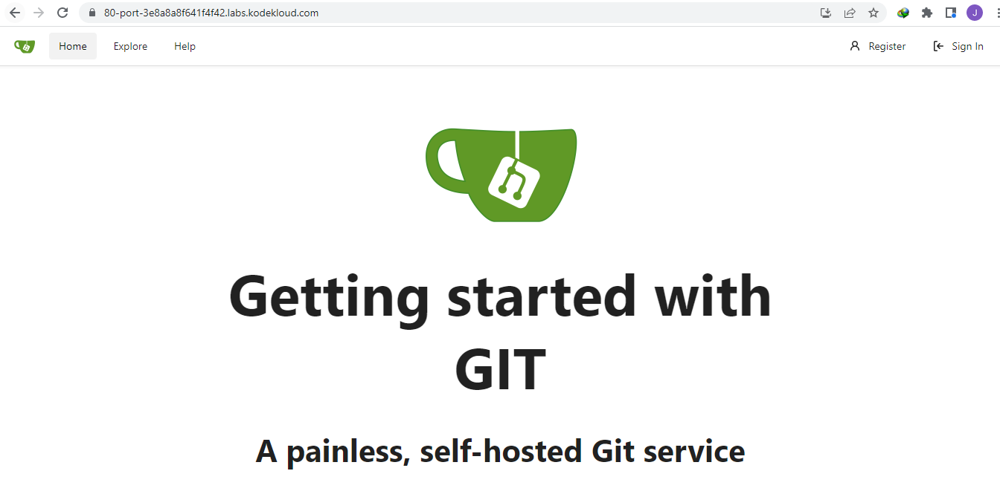
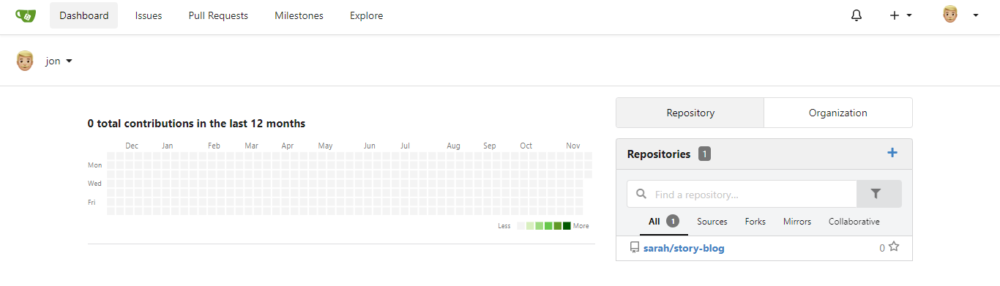
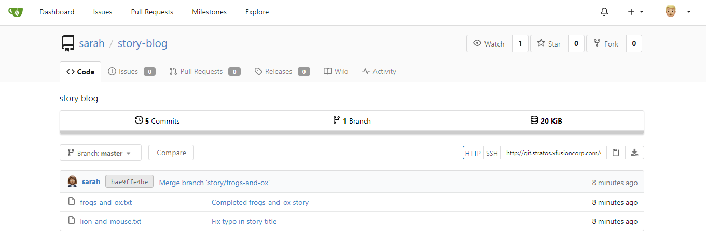
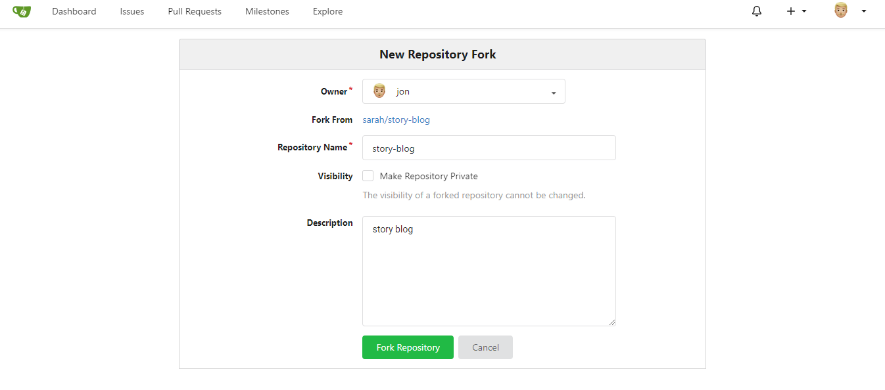

------------------------------

Start: &nbsp;&nbsp;&nbsp;&nbsp;&nbsp;&nbsp;&nbsp;&nbsp;2022-11-22 07:54:48  
Finished: &nbsp;&nbsp;2022-11-22 08:13:19

------------------------------

- [Requirements](#requirements)
- [Steps](#steps)
- [References](#references)

------------------------------

# TASK 60: Git Fork a Repository

## Requirements

There is a Git server used by the Nautilus project teams. Recently a new developer Jon joined the team and needs to start working on a project. To do so, he needs to fork an existing Git repository. Below you can find more details:

- Click on the Gitea UI button on the top bar. You should be able to access the Gitea page.

- Login to Gitea server using username jon and password Jon_pass123.

- There you will see a Git repository sarah/story-blog, fork it under jon user.

Note: For these kind of scenarios requiring changes to be done in a web UI, please take screenshots so that you can share it with us for review in case your task is marked incomplete. You may also consider using a screen recording software such as loom.com to record and share your work.

------------------------------

## Steps

Click sign-in at the top right. When prompted, enter the credentials for user Jon.

  

In the dashboard, click the repo at the right.

  

Click the **Fork** ab at the right, then click **Fork repository** in the next page.

  

  

------------------------------

## References