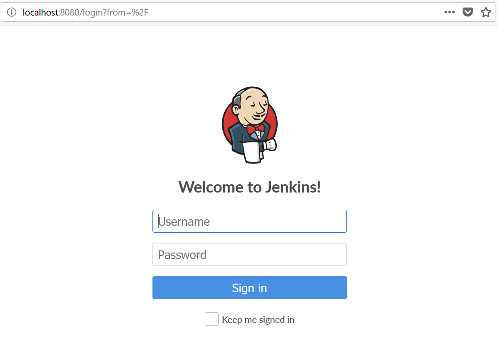

------------------------------

Start: &nbsp;&nbsp;&nbsp;&nbsp;&nbsp;&nbsp;&nbsp;&nbsp;2022-11-25 16:12:45  
Finished: &nbsp;&nbsp;2022-11-25 16:50:00

------------------------------

- [Requirements](#requirements)
- [Steps](#steps)
- [References](#references)

------------------------------

# TASK 62: Deploy Jenkins on Kubernetes

## Requirements

The Nautilus DevOps team is planning to set up a Jenkins CI server to create/manage some deployment pipelines for some of the projects. They want to set up the Jenkins server on Kubernetes cluster. Below you can find more details about the task:

1) Create a namespace jenkins

2) Create a Service for jenkins deployment. Service name should be jenkins-service under jenkins namespace, type should be NodePort, nodePort should be 30008

3) Create a Jenkins Deployment under jenkins namespace, It should be name as jenkins-deployment , labels app should be jenkins , container name should be jenkins-container , use jenkins/jenkins image , containerPort should be 8080 and replicas count should be 1.

Make sure to wait for the pods to be in running state and make sure you are able to access the Jenkins login screen in the browser before hitting the Check button.

Note: The kubectl utility on jump_host has been configured to work with the kubernetes cluster.

------------------------------

## Steps

Create the manifest for the namespace, deployment, and service. 
We can put all resource definitions in a single file.


```bash
$ cat > jenkins.yml

apiVersion: v1
kind: Namespace
metadata:
  name: jenkins
  labels:
    app: jenkins
---
apiVersion: v1
kind: Service
metadata:
  name: jenkins-service
  namespace: jenkins
  labels:
    app: jenkins
spec:
  type: NodePort
  ports: 
    - port: 8080
      targetPort: 8080
      nodePort: 30008
  selector:
    app: jenkins
---
apiVersion: apps/v1
kind: Deployment
metadata:
  name: jenkins-deployment
  namespace: jenkins
  labels:
     app: jenkins
spec:
  replicas: 1
  selector:
    matchLabels:
      app: jenkins
  template:
    metadata:
      labels:
        app: jenkins
    spec:
      containers:
      - name: jenkins-container
        image: jenkins/jenkins
        ports:
        - containerPort: 8080
```

Apply the resources.

```bash
kubectl apply -f jenkins.yml 
```

Verify the namespace.

```bash
$ kubectl get ns
NAME                 STATUS   AGE
default              Active   108m
jenkins              Active   5m40s
kube-node-lease      Active   109m
kube-public          Active   109m
kube-system          Active   109m
local-path-storage   Active   108m 
```

Check the Pods. It may take a few minutes for the Pod status to change from "ContainerCreating" to "Running".

```bash
$ kubectl get pods -n jenkins
NAME                                  READY   STATUS    RESTARTS   AGE
jenkins-deployment-6b6c78f968-pjxfh   1/1     Running   0          101s
```

Check the service. It should show the "TYPE" as "NodePort".
```bash
$ kubectl get svc -n jenkins
NAME              TYPE       CLUSTER-IP      EXTERNAL-IP   PORT(S)          AGE
jenkins-service   NodePort   10.96.132.225   <none>        8080:30008/TCP   2m45s 
```

Click the "Jenkins" button at the upper right to open a new tab which connects to the port defined in the manifest. In the new tab, you should see the Jenkins login page.


  

------------------------------

## References

- https://kodekloud.com/community/t/task-failed-deploy-jenkins-on-kubernetes/12552/3
- https://kodekloud.com/community/t/task-deploy-jenkins-on-kubernetes-marked-failed/11331