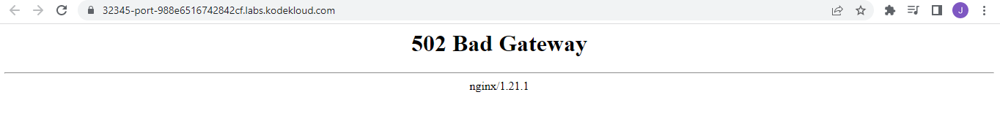

------------------------------

Start: &nbsp;&nbsp;&nbsp;&nbsp;&nbsp;&nbsp;&nbsp;&nbsp;2023-01-05 15:06:29  
Finished: &nbsp;&nbsp;2023-01-05 15:46:33

------------------------------

- [Requirements](#requirements)
- [Steps](#steps)
- [Resources](#resources)

------------------------------

# TASK 84: Fix python app deployed on kubernetes cluster

## Requirements

One of the DevOps engineers was trying to deploy a python app on Kubernetes cluster. Unfortunately, due to some mis-configuration, the application is not coming up. Please take a look into it and fix the issues. Application should be accessible on the specified nodePort.

- The deployment name is **python-deployment-devops**, its using **poroko/flask-demo-app** image. The deployment and service of this app is already deployed.

- nodePort should be **32345** and targetPort should be python flask app's **default port**.

Note: The kubectl on jump_host has been configured to work with the kubernetes cluster.

------------------------------

## Steps

Check all the running resources. Here we can see that the Pod has a status of "ImagePullBackOff" which gives us an idea that the issue could be related to the container image used.

```bash
~$ kubectl get all
NAME                                            READY   STATUS             RESTARTS   AGE
pod/python-deployment-devops-54f5444ffb-2fkzs   0/1     ImagePullBackOff   0          2m11s

NAME                            TYPE        CLUSTER-IP     EXTERNAL-IP   PORT(S)          AGE
service/kubernetes              ClusterIP   10.96.0.1      <none>        443/TCP          83m
service/python-service-devops   NodePort    10.96.112.96   <none>        8080:32345/TCP   2m11s

NAME                                       READY   UP-TO-DATE   AVAILABLE   AGE
deployment.apps/python-deployment-devops   0/1     1            0           2m11s

NAME                                                  DESIRED   CURRENT   READY   AGE
replicaset.apps/python-deployment-devops-54f5444ffb   1         1         0       2m11s 
```

Check the logs of the Pod. 

```bash
~$ kubectl logs python-deployment-devops-54f5444ffb-2fkzs
Error from server (BadRequest): container "python-container-devops" in pod "python-deployment-devops-54f5444ffb-2fkzs" is waiting to start: trying and failing to pull image 
```

The logs did not provide much information. We can **describe** the Pod.

```bash
~$ kubectl describe pod/python-deployment-devops-54f5444ffb-2fkzs
Name:         python-deployment-devops-54f5444ffb-2fkzs
Namespace:    default
Priority:     0
Node:         kodekloud-control-plane/172.17.0.2
Start Time:   Thu, 05 Jan 2023 07:05:22 +0000
Labels:       app=python_app
              pod-template-hash=54f5444ffb
Annotations:  <none>
Status:       Pending
IP:           10.244.0.5
IPs:
  IP:           10.244.0.5
Controlled By:  ReplicaSet/python-deployment-devops-54f5444ffb
Containers:
  python-container-devops:
    Container ID:   
    Image:          poroko/flask-app-demo
    Image ID:       
    Port:           5000/TCP
    Host Port:      0/TCP
    State:          Waiting
      Reason:       ErrImagePull
    Ready:          False
    Restart Count:  0
    Environment:    <none>
    Mounts:
      /var/run/secrets/kubernetes.io/serviceaccount from default-token-s8zkd (ro)
Conditions:
  Type              Status
  Initialized       True 
  Ready             False 
  ContainersReady   False 
  PodScheduled      True 
Volumes:
  default-token-s8zkd:
    Type:        Secret (a volume populated by a Secret)
    SecretName:  default-token-s8zkd
    Optional:    false
QoS Class:       BestEffort
Node-Selectors:  <none>
Tolerations:     node.kubernetes.io/not-ready:NoExecute op=Exists for 300s
                 node.kubernetes.io/unreachable:NoExecute op=Exists for 300s
Events:
  Type     Reason     Age                   From               Message
  ----     ------     ----                  ----               -------
  Normal   Scheduled  3m16s                 default-scheduler  Successfully assigned default/python-deployment-devops-54f5444ffb-2fkzs to kodekloud-control-plane
  Normal   Pulling    108s (x4 over 3m15s)  kubelet            Pulling image "poroko/flask-app-demo"
  Warning  Failed     108s (x4 over 3m14s)  kubelet            Failed to pull image "poroko/flask-app-demo": rpc error: code = Unknown desc = failed to pull and unpack image "docker.io/poroko/flask-app-demo:latest": failed to resolve reference "docker.io/poroko/flask-app-demo:latest": pull access denied, repository does not exist or may require authorization: server message: insufficient_scope: authorization failed
  Warning  Failed     108s (x4 over 3m14s)  kubelet            Error: ErrImagePull
  Warning  Failed     81s (x6 over 3m14s)   kubelet            Error: ImagePullBackOff
  Normal   BackOff    66s (x7 over 3m14s)   kubelet            Back-off pulling image "poroko/flask-app-demo" 
``` 

Notice that in the **Event** section, there's a a **Warning** with a message that says:

```bash
Failed to pull image "poroko/flask-app-demo" 
```

Reading the requirements again, we discover that it's the deployment is using the wrong image. We can edit the deployment using the **edit** command or we can also generate a YAML file, edit the file, and apply it. For now, we can just directly edit.

```bash
kubectl edit deployment/python-deployment-devops
```

Change the details from:

```bash
    spec:
      containers:
      - image: poroko/flask-demo-app
        imagePullPolicy: Always
        name: python-container-devops
        ports: 
```

to:

```bash
    spec:
      containers:
      - image: poroko/flask-app-demo
        imagePullPolicy: Always
        name: python-container-devops
        ports:  
```

The changes should reflect immediately once you save and exit the editor. Check the Pods again.

```bash
~$ kubectl get pod
NAME                                        READY   STATUS    RESTARTS   AGE
python-deployment-devops-7f4b76855b-68zw9   1/1     Running   0          71s
```

Now click the **App** button at the upper right to open a new tab. We should now see the landing page of the App. However, it seems there's still some issue on the deployment.

  

Checking the logs for the Pod, we can see that it's running on port 5000.

```bash
~$ kubectl logs python-deployment-devops-7f4b76855b-68zw9
 * Serving Flask app "app.py"
 * Environment: production
   WARNING: Do not use the development server in a production environment.
   Use a production WSGI server instead.
 * Debug mode: off
 * Running on http://0.0.0.0:5000/ (Press CTRL+C to quit) 
```

Try to check the service. Here we can see the nodeport 32345 is correctly assigned, however the targetPort its using is 8080, not the default port 5000.

```bash
~$ kubectl get svc
NAME                    TYPE        CLUSTER-IP     EXTERNAL-IP   PORT(S)          AGE
kubernetes              ClusterIP   10.96.0.1      <none>        443/TCP          106m
python-service-devops   NodePort    10.96.112.96   <none>        8080:32345/TCP   24m
```

We need to edit the Service. SInce we've already used the **edit** command, we can try to generate a YAML file for the service by forwarding the YAML output of the **get** command to a file.

```bash
kubectl get svc python-service-devops -o yaml > python-service-devops.yml 
```

Edit the file.

```bash
~$ vi python-service-devops.yml  

  ports:
  - nodePort: 32345
    port: 5000
    protocol: TCP
    targetPort: 5000
```

```bash
~$ kubectl apply -f python-service-devops.yml 
~$ kubectl get svc
NAME                    TYPE        CLUSTER-IP     EXTERNAL-IP   PORT(S)          AGE
kubernetes              ClusterIP   10.96.0.1      <none>        443/TCP          112m
python-service-devops   NodePort    10.96.112.96   <none>        5000:32345/TCP   31m
```

Now check the the other tab again.

  

------------------------------

## Resources