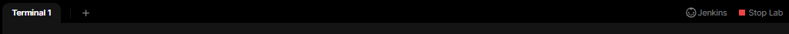
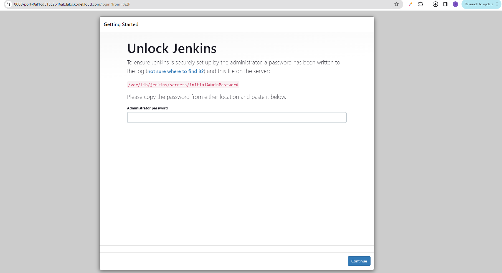
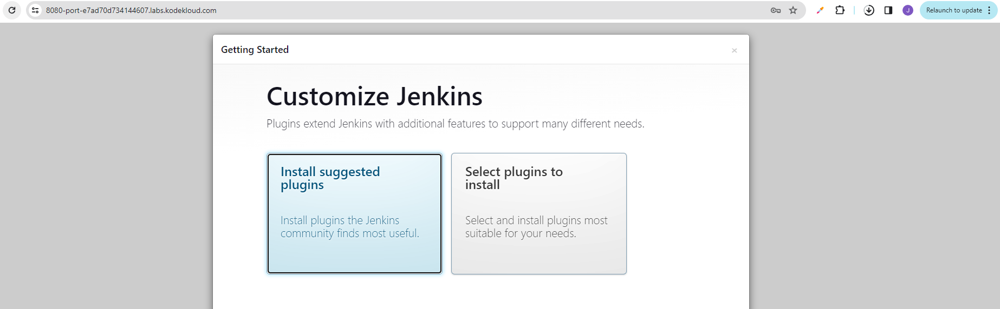
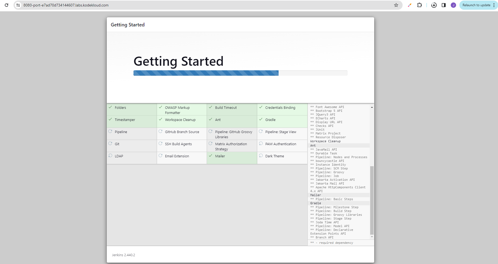
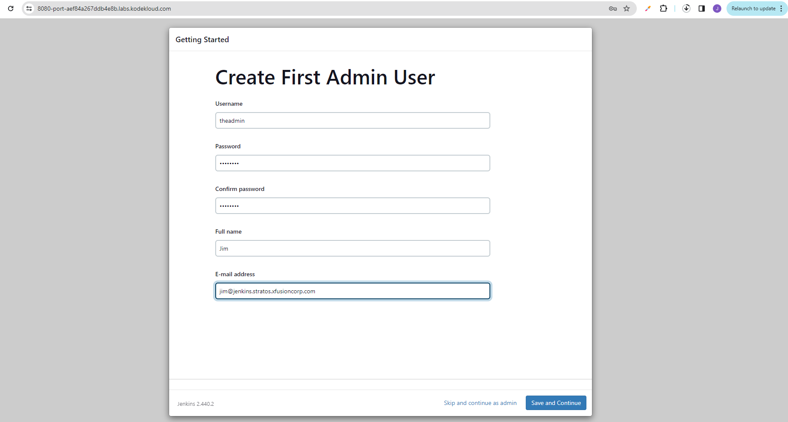
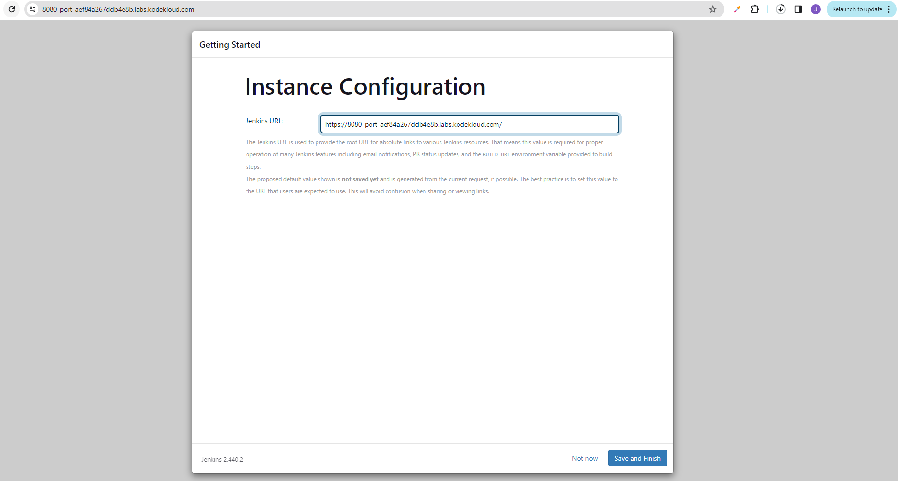
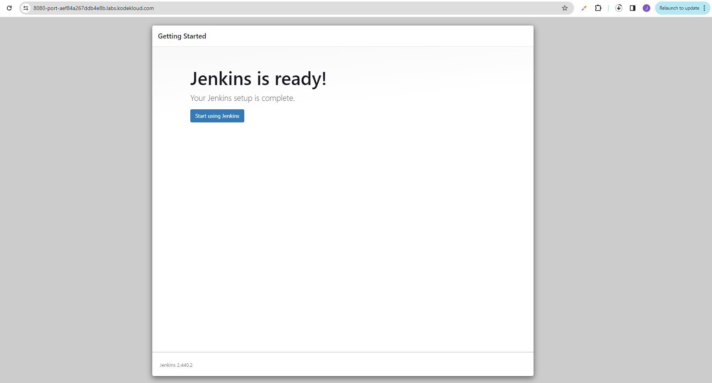
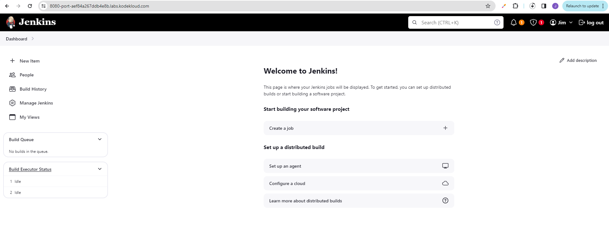

------------------------------

Start: &nbsp;&nbsp;&nbsp;&nbsp;&nbsp;&nbsp;&nbsp;&nbsp; 2024-03-31 03:52:00 
Finished: &nbsp;&nbsp; 2024-03-31 05:02:00 

------------------------------

- [Requirements](#requirements)
- [Steps](#steps)
- [Resources](#resources)

------------------------------

# Lab 001: Jenkins Installation

## Requirements

The DevOps team of xFusionCorp Industries is planning to setup some CI/CD pipelines. After several meetings they have decided to use Jenkins server. So, we need to setup a Jenkins Server as soon as possible. Please complete the task as per requirements mentioned below:

1. Install jenkins on jenkins server using yum utility only, and start its service. You might face timeout issue while starting the Jenkins service, please refer this link for help.

2. Jenkin's admin user name should be theadmin, password should be Adm!n321, full name should be Kareem and email should be kareem@jenkins.stratos.xfusioncorp.com.

Note:

1. For this task, ssh into the jenkins server using user root and password S3curePass from jump host.

2. After installing the Jenkins server, please click on the Jenkins button on the top bar to access Jenkins UI and follow the on-screen instructions to create an admin user.

------------------------------

## Steps

For the server credentials, check out the [Project Nautilus documentation.](https://kodekloudhub.github.io/kodekloud-engineer/docs/projects/nautilus)

Since it was mentioned to use a different login, follow that instead.

```bash
# Jenkins Server for CI/CD
sshpass -p 'S3curePass' ssh -o StrictHostKeyChecking=no  root@172.16.238.19
```

Install Jenkins. Note that you may get a CentOS or Ubuntu OS for your session.

For CentOS:

```bash
yum update -y  

sudo yum install epel-release java-17-openjdk wget -y

sudo wget -O /etc/yum.repos.d/jenkins.repo https://pkg.jenkins.io/redhat-stable/jenkins.repo --no-check-certificate
sudo rpm --import http://pkg.jenkins.io/redhat-stable/jenkins.io-2023.key

sudo yum update -y
sudo yum install jenkins -y
```

For Ubuntu:

```bash
apt update
apt search openjdk
apt install openjdk-8-dbg
java -version

# add the key 
wget -q -O - https://pkg.jenkins.io/debian/jenkins.io.key | sudo apt-key add -
sh -c 'echo deb https://pkg.jenkins.io/debian binary/ > \
    /etc/apt/sources.list.d/jenkins.list'

apt install apt-transport-https
apt update
apt install jenkins
```

Start Jenkins.

```bash
sudo systemctl status jenkins
sudo systemctl start jenkins && sudo systemctl status jenkins 
```

Get the initial admin password.

```bash
cat /var/lib/jenkins/secrets/initialAdminPassword 
```

Click the **Jenkins** button at the top right to open the Jenkins page in a new tab. 



Enter the copied admin password. 





If the some of the plugins fail to install, hit retry.



Provide the admin user according to the instructions.










------------------------------

## Resources

- [Install Jenkins on a Ubuntu server](https://www.nbtechsupport.co.in/2021/06/install-jenkins-server.html)
- [Unable to install Jenkins Server](https://kodekloud.com/community/t/unable-to-install-jenkins-server/17699)
- [Jenkins installation error](https://kodekloud.com/community/t/jenkins-installation-error/340237)