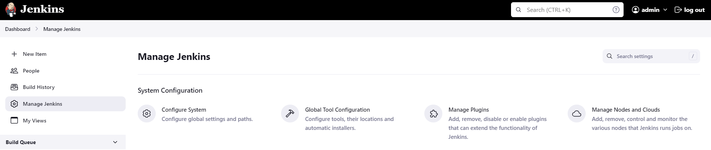
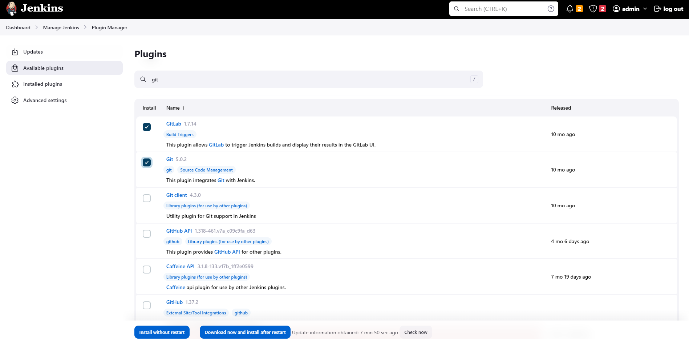
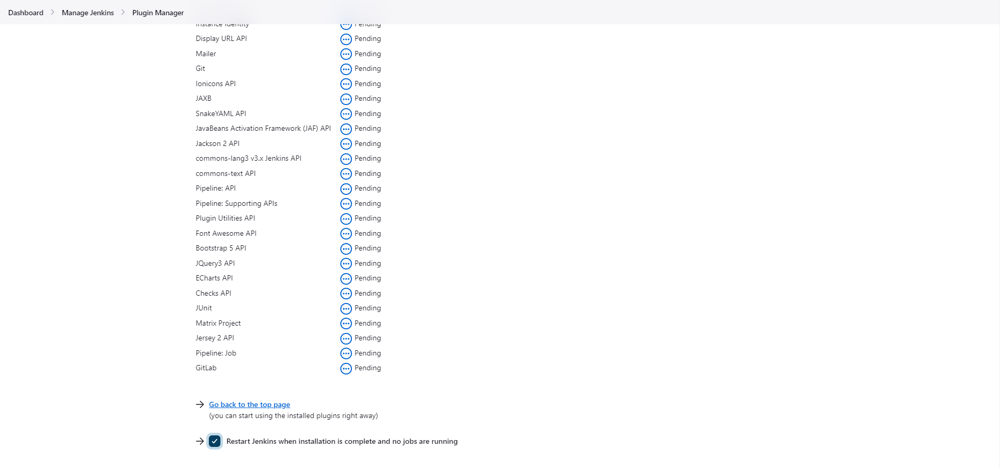

 
------------------------------

Start: &nbsp;&nbsp;&nbsp;&nbsp;&nbsp;&nbsp;&nbsp;&nbsp;2024-03-31 19:47:48   
Finished: &nbsp;&nbsp;

*The Kodekloud platform has extremely response time.*

------------------------------

- [Requirements](#requirements)
- [Steps](#steps)
- [Resources](#resources)

------------------------------

# Lab 002: Jenkins Plugins

## Requirements

The Nautilus DevOps team has recently setup a Jenkins server, which they want to use for some CI/CD jobs. Before that they want to install some plugins which will be used in most of the jobs. Please find below more details about the task

Click on the Jenkins button on the top bar to access the Jenkins UI. Login using username admin and Adm!n321 password.

1. Once logged in, install Git and GitLab plugins. You might need to restart Jenkins service to install these plugins, so we recommend clicking on Restart Jenkins when installation is complete and no jobs are running on plugin installation/update page i.e update centre.

Note:

1. Once you restart Jenkins service it will go down for some time so please wait for the Jenkins login page to come back before clicking on the Check button.

2. For these scenarios requiring changes to be done in a web UI, please take screenshots so you can share them with us for review in case your task is marked incomplete. You may also consider using screen recording software like loom.com to record and share your work.

------------------------------

## Steps

Click the Jenkins button and in the new tab, sign-in to Jenkins.

Click Manage Jenkins > Manage plugins > Available plugins

Search for the Git and Gitlab plugins > Download now and install after restart.

Make sure to click **Restart Jenkins when installation is complete** in the next page.

After restart, login and verify that the plugins are installed.

------------------------------

## Resources