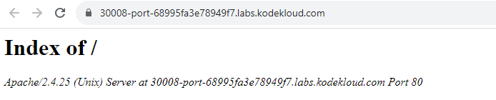
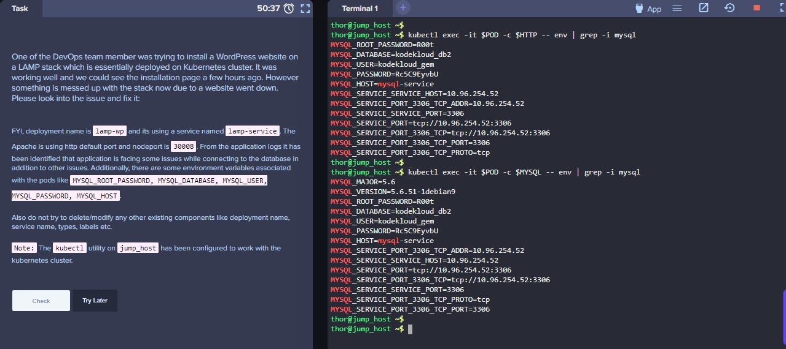
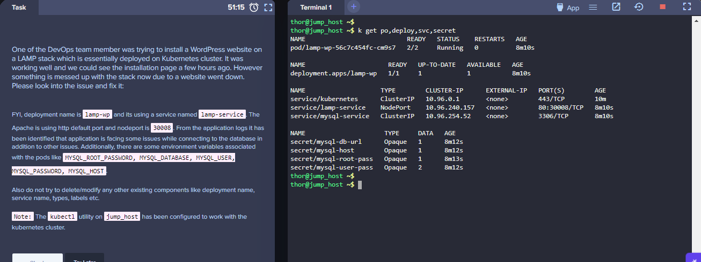
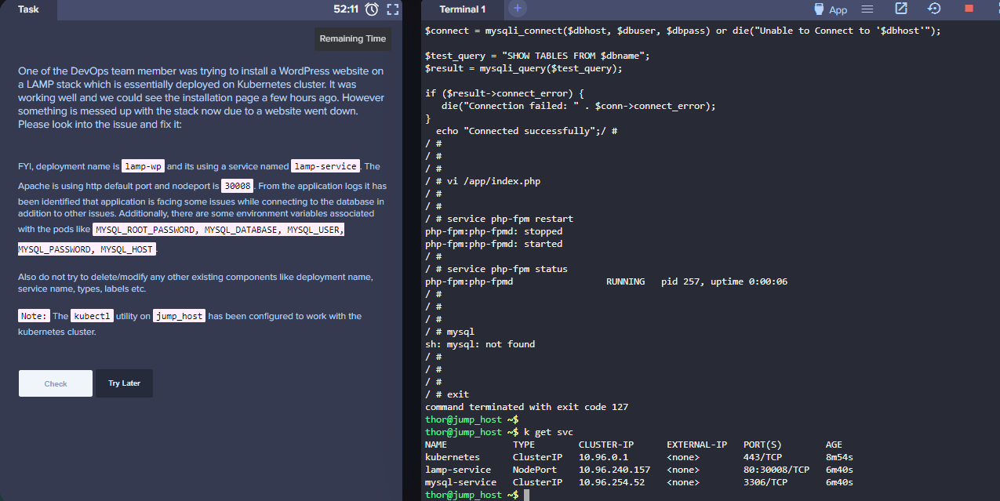

------------------------------

Start: &nbsp;&nbsp;&nbsp;&nbsp;&nbsp;&nbsp;&nbsp;&nbsp;2023-08-12 10:40:18  
Finished: &nbsp;&nbsp;2023-08-12 17:56:38

------------------------------

- [Requirements](#requirements)
- [Steps](#steps)
- [Resources](#resources)

------------------------------

# Lab 011: Fix issue wih LAMP Environment in Kubernetes 

> *This is an extremely buggy lab. Was about to just skip it because I've spent one day already.*

## Requirements

One of the DevOps team member was trying to install a WordPress website on a LAMP stack which is essentially deployed on Kubernetes cluster. It was working well and we could see the installation page a few hours ago. However something is messed up with the stack now due to a website went down. Please look into the issue and fix it:

- FYI, deployment name is **lamp-wp** and its using a service named **lamp-service**. 
- The Apache is using **http default port** and **nodeport is 30008**. 

From the application logs it has been identified that:

- application is facing some issues while connecting to the database in addition to other issues. 
- Additionally, there are some environment variables associated with the pods like:
    
    - MYSQL_ROOT_PASSWORD
    - MYSQL_DATABASE
    - MYSQL_USER
    - MYSQL_PASSWORD
    - MYSQL_HOST.


Also **do not try to delete/modify any other existing components like deployment name, service name, types, labels** etc.

Note: The kubectl utility on jump_host has been configured to work with the kubernetes cluster.

------------------------------

## Steps


```bash
thor@jump_host ~$ k get po,deploy,svc,secrets
NAME                           READY   STATUS    RESTARTS   AGE
pod/lamp-wp-56c7c454fc-cm9s7   2/2     Running   0          45s

NAME                      READY   UP-TO-DATE   AVAILABLE   AGE
deployment.apps/lamp-wp   1/1     1            1           45s

NAME                    TYPE        CLUSTER-IP      EXTERNAL-IP   PORT(S)        AGE
service/kubernetes      ClusterIP   10.96.0.1       <none>        443/TCP        2m59s
service/lamp-service    NodePort    10.96.240.157   <none>        80:30009/TCP   45s
service/mysql-service   ClusterIP   10.96.254.52    <none>        3306/TCP       45s

NAME                     TYPE     DATA   AGE
secret/mysql-db-url      Opaque   1      47s
secret/mysql-host        Opaque   1      47s
secret/mysql-root-pass   Opaque   1      48s
secret/mysql-user-pass   Opaque   2      47s
```

Test the URL.


From the httpd container, test connectivity to the MySQL. 

```bash
thor@jump_host ~$ kubectl exec -it lamp-wp-56c7c454fc-cm9s7 -c httpd-php-container -- mysql
error: Internal error occurred: error executing command in container: failed to exec in container: failed to start exec "3ec1ff6f26403ab5b3b4a7f94622dee230ac71fa6995c9283ebad334ad78e9aa": OCI runtime exec failed: exec failed: unable to start container process: exec: "mysql": executable file not found in $PATH: unknown
```

----------------------------------------------

**NOTE**
In some iterations of the labs, the nodePort could be showing 30009 or any other port instead of 30008. If you encountered this, retrieve the YAML and modify it.

```bash
thor@jump_host ~$ k get svc lamp-service -o yaml > lamp-svc.yml
thor@jump_host ~$ vi lamp-svc.yml  
```

While inside the vi editor, type this to replace all 30009 with 30008.

```bash
:%s/30009/30008/g 
```

In addition to this, the port and targetPort might show as 8080. Change this to 80.

```bash
:%s/8080/80/g 
```

After changing, apply.

```bash
thor@jump_host ~$ k apply -f lamp-svc.yml 
service/lamp-service configured 
```

Verify.

```bash
thor@jump_host ~$ k get svc
NAME            TYPE        CLUSTER-IP      EXTERNAL-IP   PORT(S)        AGE
kubernetes      ClusterIP   10.96.0.1       <none>        443/TCP        4m52s
lamp-service    NodePort    10.96.240.157   <none>        80:30008/TCP   2m38s
mysql-service   ClusterIP   10.96.254.52    <none>        3306/TCP       2m38s
```

----------------------------------------------

To make the troubleshooting easier, we can save the container names and pod name.


```bash
thor@jump_host ~$ HTTP=$(kubectl get pod  -o=jsonpath='{.items[*].spec.containers[0].name}') ; echo "HTTP: $HTTP"
HTTP: httpd-php-container

thor@jump_host ~$ MYSQL=$(kubectl get pod -o=jsonpath='{.items[*].spec.containers[1].name}')  ; echo "MYSQL: $MYSQL"
MYSQL: mysql-container

thor@jump_host ~$ POD=$(kubectl get pods -o=jsonpath='{.items[*].metadata.name}'); echo "POD: $POD"
POD: lamp-wp-56c7c454fc-s7xf5
``` 

Check the logs of the HTTP container. On all iterations of the labs, the lgos will show that there was an incorrect variable. Now we'll immediately think that the environment variable needs to be corrected on the deployment YAML file, but this is not the case as the YAML file follows the instructions. 

Instead, we need to modify the PHP file inside the HTTP container.

```bash
k logs -f $POD -c $HTTP 
```


```bash
thor@jump_host ~$ k logs -f $POD -c $HTTP
-> Executing /opt/docker/provision/entrypoint.d/05-permissions.sh
-> Executing /opt/docker/provision/entrypoint.d/20-php-fpm.sh
-> Executing /opt/docker/provision/entrypoint.d/20-php.sh
-> Executing /opt/docker/bin/service.d/supervisor.d//10-init.sh
2023-08-12 09:22:58,733 CRIT Set uid to user 0
2023-08-12 09:22:58,733 WARN Included extra file "/opt/docker/etc/supervisor.d/apache.conf" during parsing
2023-08-12 09:22:58,733 WARN Included extra file "/opt/docker/etc/supervisor.d/cron.conf" during parsing
2023-08-12 09:22:58,733 WARN Included extra file "/opt/docker/etc/supervisor.d/dnsmasq.conf" during parsing
2023-08-12 09:22:58,733 WARN Included extra file "/opt/docker/etc/supervisor.d/php-fpm.conf" during parsing
2023-08-12 09:22:58,733 WARN Included extra file "/opt/docker/etc/supervisor.d/postfix.conf" during parsing
2023-08-12 09:22:58,733 WARN Included extra file "/opt/docker/etc/supervisor.d/ssh.conf" during parsing
2023-08-12 09:22:58,733 WARN Included extra file "/opt/docker/etc/supervisor.d/syslog.conf" during parsing
2023-08-12 09:22:58,742 INFO RPC interface 'supervisor' initialized
2023-08-12 09:22:58,742 INFO supervisord started with pid 1
2023-08-12 09:22:59,745 INFO spawned: 'syslogd' with pid 89
2023-08-12 09:22:59,750 INFO spawned: 'php-fpmd' with pid 90
2023-08-12 09:22:59,815 INFO spawned: 'apached' with pid 91
2023-08-12 09:22:59,820 INFO spawned: 'crond' with pid 95
-> Executing /opt/docker/bin/service.d/syslog-ng.d//10-init.sh
-> Executing /opt/docker/bin/service.d/php-fpm.d//10-init.sh
Setting php-fpm user to application
-> Executing /opt/docker/bin/service.d/httpd.d//10-init.sh
2023-08-12 09:22:59,822 INFO success: php-fpmd entered RUNNING state, process has stayed up for > than 0 seconds (startsecs)
2023-08-12 09:22:59,822 INFO success: apached entered RUNNING state, process has stayed up for > than 0 seconds (startsecs)
2023-08-12 09:22:59,822 INFO success: crond entered RUNNING state, process has stayed up for > than 0 seconds (startsecs)
[SYSLOG] syslog-ng[89]: syslog-ng starting up; version='3.7.2'
-> Executing /opt/docker/bin/service.d/cron.d//10-init.sh
[Sat Aug 12 09:23:00.215107 2023] [so:warn] [pid 113:tid 140558160104264] AH01574: module socache_shmcb_module is already loaded, skipping
[Sat Aug 12 09:23:00.316735 2023] [so:warn] [pid 113:tid 140558160104264] AH01574: module socache_shmcb_module is already loaded, skipping
[Sat Aug 12 09:23:00.319582 2023] [lbmethod_heartbeat:notice] [pid 113:tid 140558160104264] AH02282: No slotmem from mod_heartmonitor
[Sat Aug 12 09:23:00.419030 2023] [mpm_event:notice] [pid 113:tid 140558160104264] AH00489: Apache/2.4.25 (Unix) LibreSSL/2.4.4 configured -- resuming normal operations
[Sat Aug 12 09:23:00.419060 2023] [core:notice] [pid 113:tid 140558160104264] AH00094: Command line: '/usr/sbin/httpd -D FOREGROUND'
2023-08-12 09:23:01,117 INFO success: syslogd entered RUNNING state, process has stayed up for > than 1 seconds (startsecs)
[12-Aug-2023 09:23:01] NOTICE: fpm is running, pid 90
[12-Aug-2023 09:23:01] NOTICE: ready to handle connections 
```

Open a shell to the HTTP container and find the **index.php** file.


```bash
thor@jump_host ~$ k exec -it $POD -c $HTTP -- sh
/ # 
/ # ls -la
total 96
drwxr-xr-x    1 root     root          4096 Aug 12 07:36 .
drwxr-xr-x    1 root     root          4096 Aug 12 07:36 ..
srwx------    1 root     root             0 Aug 12 07:36 .supervisor.sock
drwxr-xr-x    1 applicat applicat      4096 Aug 12 07:37 app
drwxr-xr-x    1 root     root          4096 Jul  2  2017 bin
drwxr-xr-x    5 root     root           380 Aug 12 07:36 dev
lrwxrwxrwx    1 root     root            12 Aug 12 07:36 docker.stderr -> /proc/1/fd/2
lrwxrwxrwx    1 root     root            12 Aug 12 07:36 docker.stdout -> /proc/1/fd/1
lrwxrwxrwx    1 root     root            29 Jul  2  2017 entrypoint -> /opt/docker/bin/entrypoint.sh
lrwxrwxrwx    1 root     root            28 Jul  2  2017 entrypoint.cmd -> /opt/docker/bin/entrypoint.d
drwx------    2 root     root          4096 Jul  2  2017 entrypoint.d
drwxr-xr-x    1 root     root          4096 Aug 12 07:36 etc
drwxr-xr-x    1 root     root          4096 Jul  2  2017 home
drwxr-xr-x    1 root     root          4096 Jul  2  2017 lib
drwxr-xr-x    2 root     root          4096 Jul  2  2017 log
drwxr-xr-x    5 root     root          4096 Jun 25  2017 media
drwxr-xr-x    2 root     root          4096 Jun 25  2017 mnt
drwxr-xr-x    1 root     root          4096 Jul  2  2017 opt
dr-xr-xr-x 1951 root     root             0 Aug 12 07:36 proc
drwx------    1 root     root          4096 Aug 12 07:42 root
drwxr-xr-x    1 root     root          4096 Aug 12 07:36 run
drwxr-xr-x    1 root     root          4096 Jul  2  2017 sbin
drwxr-xr-x    2 root     root          4096 Jun 25  2017 srv
dr-xr-xr-x   13 nobody   nobody           0 Aug 12 07:36 sys
drwxrwxrwt    1 root     root          4096 Aug 12 07:36 tmp
drwxr-xr-x    1 root     root          4096 Jul  2  2017 usr
drwxr-xr-x    1 root     root          4096 Jul  2  2017 var
/ # 
/ # ls -la app
total 12
drwxr-xr-x    1 applicat applicat      4096 Aug 12 07:37 .
drwxr-xr-x    1 root     root          4096 Aug 12 07:36 ..
-rw-r--r--    1 root     root           435 Aug 12 07:37 index.php 
```

Check the index.app file. Here we can see that there's some typo error here. Edit this to match the variables specified in the instructions/requirements. 

```bash
thor@jump_host ~$ k exec -it $POD -c $HTTP -- sh
/ # 
/ # cat /app/index.php 
<?php
$dbname = $_ENV['MYSQL_DATABASE'];
$dbuser = $_ENV['MYSQL_USER'];
$dbpass = $_ENV[''MYSQL_PASSWORD""];
$dbhost = $_ENV['MYSQL-HOST'];

$connect = mysqli_connect($dbhost, $dbuser, $dbpass) or die("Unable to Connect to '$dbhost'");

$test_query = "SHOW TABLES FROM $dbname";
$result = mysqli_query($test_query);

if ($result->connect_error) {
   die("Connection failed: " . $conn->connect_error);
}
  echo "Connected successfully";/  
```

Specifically:

```bash
$dbpass = $_ENV['MYSQL_PASSWORD'];   
$dbhost = $_ENV['MYSQL_HOST'];
```

While inside the container, restart the **php-fpm** service. Afterwards, exit out of the container. 

```bash
/ # service php-fpm restart
php-fpm:php-fpmd: stopped
php-fpm:php-fpmd: started
/ # 
/ # service php-fpm status
php-fpm:php-fpmd                 RUNNING   pid 257, uptime 0:00:06 
/ # 
/ # exit
```

Check the environment variables in both containers. 

```bash 
thor@jump_host ~$ kubectl exec -it $POD -c $HTTP -- env | grep -i mysql
MYSQL_HOST=mysql-service
MYSQL_ROOT_PASSWORD=R00t
MYSQL_DATABASE=kodekloud_db2
MYSQL_USER=kodekloud_gem
MYSQL_PASSWORD=Rc5C9EyvbU
MYSQL_SERVICE_SERVICE_HOST=10.96.180.64
MYSQL_SERVICE_PORT=tcp://10.96.180.64:3306
MYSQL_SERVICE_PORT_3306_TCP=tcp://10.96.180.64:3306
MYSQL_SERVICE_PORT_3306_TCP_PROTO=tcp
MYSQL_SERVICE_PORT_3306_TCP_ADDR=10.96.180.64
MYSQL_SERVICE_SERVICE_PORT=3306
MYSQL_SERVICE_PORT_3306_TCP_PORT=3306

thor@jump_host ~$ kubectl exec -it $POD -c $MYSQL -- env | grep -i mysql
MYSQL_MAJOR=5.6
MYSQL_VERSION=5.6.51-1debian9
MYSQL_PASSWORD=Rc5C9EyvbU
MYSQL_HOST=mysql-service
MYSQL_ROOT_PASSWORD=R00t
MYSQL_DATABASE=kodekloud_db2
MYSQL_USER=kodekloud_gem
MYSQL_SERVICE_SERVICE_PORT=3306
MYSQL_SERVICE_PORT_3306_TCP=tcp://10.96.180.64:3306
MYSQL_SERVICE_PORT=tcp://10.96.180.64:3306
MYSQL_SERVICE_PORT_3306_TCP_ADDR=10.96.180.64
MYSQL_SERVICE_PORT_3306_TCP_PORT=3306
MYSQL_SERVICE_SERVICE_HOST=10.96.180.64
MYSQL_SERVICE_PORT_3306_TCP_PROTO=tcp

thor@jump_host ~$ kubectl describe pod | grep -A 6 Env
    Environment:
      MYSQL_ROOT_PASSWORD:  <set to the key 'password' in secret 'mysql-root-pass'>  Optional: false
      MYSQL_DATABASE:       <set to the key 'database' in secret 'mysql-db-url'>     Optional: false
      MYSQL_USER:           <set to the key 'username' in secret 'mysql-user-pass'>  Optional: false
      MYSQL_PASSWORD:       <set to the key 'password' in secret 'mysql-user-pass'>  Optional: false
      MYSQL_HOST:           <set to the key 'host' in secret 'mysql-host'>           Optional: false
    Mounts:
--
    Environment:
      MYSQL_ROOT_PASSWORD:  <set to the key 'password' in secret 'mysql-root-pass'>  Optional: false
      MYSQL_DATABASE:       <set to the key 'database' in secret 'mysql-db-url'>     Optional: false
      MYSQL_USER:           <set to the key 'username' in secret 'mysql-user-pass'>  Optional: false
      MYSQL_PASSWORD:       <set to the key 'password' in secret 'mysql-user-pass'>  Optional: false
      MYSQL_HOST:           <set to the key 'host' in secret 'mysql-host'>           Optional: false
    Mounts:
```

Click the **App** button at the top right to open the app URL in the new tab. 


In the new tab, we should see the message:


----------------------------------------------

**NOTE**

I've tried this lab for multiple times and there are instances where all the steps are correct but the landing page will show something like this:



In this case, just restart the lab by clicking **Try Later**

DO NOT CLICK **Check** because the lab will fail. The lab is buggy so you might need to repeat the steps below until you get the "Connected successfully" message. Somehow this is the only way to verify if the lab is completed successfully. 

Some additional screenshots:








------------------------------

## Resources

- https://kodekloud.com/community/t/fix-issue-with-lamp-environment-in-kubernetes/13938/21
- https://kubernetes.io/docs/tutorials/stateful-application/mysql-wordpress-persistent-volume/
- https://gitlab.com/nb-tech-support/devops/-/tree/master/Deploy%20Lamp%20Stack%20on%20Kubernetes%20Cluster?ref_type=heads
