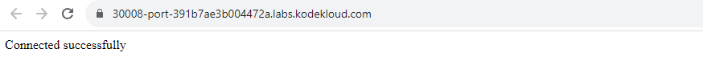

------------------------------

Start: &nbsp;&nbsp;&nbsp;&nbsp;&nbsp;&nbsp;&nbsp;&nbsp;2023-08-15 19:20:00  
Finished: &nbsp;&nbsp;2023-08-15 21:03:25

------------------------------

- [Requirements](#requirements)
- [Steps](#steps)
- [Resources](#resources)

------------------------------

# Lab 007: Kubernetes LEMP Setup

## Requirements

The Nautilus DevOps team want to deploy a static website on Kubernetes cluster. They are going to use Nginx, phpfpm and MySQL for the database. The team had already gathered the requirements and now they want to make this website live. Below you can find more details:

1. Create some secrets for MySQL.

    - Create a secret named **mysql-root-pass** wih key/value pairs as below:

        ```bash
        name: password
        value: R00t  
        ```

    - Create a secret named **mysql-user-pass** with key/value pairs as below:

        ```bash
        name: username
        value: kodekloud_aim

        name: password
        value: LQfKeWWxWD  
        ```

    - Create a secret named **mysql-db-url** with key/value pairs as below:

        ```bash
        name: database
        value: kodekloud_db9  
        ```

    - Create a secret named **mysql-host** with key/value pairs as below:

        ```bash
        name: host
        value: mysql-service  
        ```

2. Create a config map **php-config** for php.ini with variables_order = "**EGPCS**" data.

3. Create a deployment named **lemp-wp**.

    - Create two containers under it:
        
        -First container must be **nginx-php-container** using image **webdevops/php-nginx:alpine-3-php7** and 
        
        - second container must be **mysql-container** from image **mysql:5.6**. 
        
4. Mount **php-config configmap** in **nginx** container at **/opt/docker/etc/php/php.ini** location.


5. Add some environment variables for both containers. Take their values from the secrets you created.

    - MYSQL_ROOT_PASSWORD
    - MYSQL_DATABASE
    - MYSQL_USER
    - MYSQL_PASSWORD 
    - MYSQL_HOST

6. Create a **node port type service lemp-service** to expose the web application, nodePort must be **30008**.


7. Create a **service** for mysql named **mysql-service** and its port must be **3306**.


8. We already have a **/tmp/index.php** file on jump_host server.

9. Copy this file into the **nginx container under document root i.e /app** and replace the dummy values for mysql related variables with the environment variables you have set for mysql related parameters. Please make sure you do not hard code the mysql related details in this file, you must use the environment variables to fetch those values.

Once done, you must be able to access this website using Website button on the top bar, please note that you should see **Connected successfully** message while accessing this page.

Note: The kubectl on jump_host has been configured to work with the kubernetes cluster.

------------------------------

## Steps

First, check any running resources.

```bash
thor@jump_host ~$ kubectl get all 
NAME                 TYPE        CLUSTER-IP   EXTERNAL-IP   PORT(S)   AGE
service/kubernetes   ClusterIP   10.96.0.1    <none>        443/TCP   17m
```

Create the secrets.

```bash
kubectl create secret generic mysql-root-pass --from-literal=password=R00t
kubectl create secret generic mysql-user-pass --from-literal=username=kodekloud_aim --from-literal=password=LQfKeWWxWD
kubectl create secret generic mysql-db-url --from-literal=database=kodekloud_db9
kubectl create secret generic mysql-host --from-literal=host=mysql-service
```

Create the **deploy.yml**.

```bash
--- 
apiVersion: v1
kind: ConfigMap
metadata:
  name: php-config
data:
  php.ini: |
    variables_order = "EGPCS"
---
apiVersion: apps/v1
kind: Deployment
metadata:
  name: lemp-wp
spec:
  replicas: 1
  selector:
    matchLabels:
      app: lemp-wp
  template:
    metadata:
      labels:
        app: lemp-wp
    spec:
      containers:
        - name: nginx-php-container
          image: webdevops/php-nginx:alpine-3-php7
          volumeMounts:
            - name: php-config
              mountPath: /opt/docker/etc/php/php.ini
              subPath: php.ini
          env:
            - name: MYSQL_ROOT_PASSWORD
              valueFrom:
                secretKeyRef:
                  name: mysql-root-pass
                  key: password
            - name: MYSQL_DATABASE
              valueFrom:
                secretKeyRef:
                  name: mysql-db-url
                  key: database
            - name: MYSQL_USER
              valueFrom:
                secretKeyRef:
                  name: mysql-user-pass
                  key: username
            - name: MYSQL_PASSWORD
              valueFrom:
                secretKeyRef:
                  name: mysql-user-pass
                  key: password
            - name: MYSQL_HOST
              valueFrom:
                secretKeyRef:
                  name: mysql-host
                  key: host

        - name: mysql-container
          image: mysql:5.6
          ports:
          - containerPort: 3306
          resources: {}
          env:
            - name: MYSQL_ROOT_PASSWORD
              valueFrom:
                secretKeyRef:
                  name: mysql-root-pass
                  key: password
            - name: MYSQL_DATABASE
              valueFrom:
                secretKeyRef:
                  name: mysql-db-url
                  key: database
            - name: MYSQL_USER
              valueFrom:
                secretKeyRef:
                  name: mysql-user-pass
                  key: username
            - name: MYSQL_PASSWORD
              valueFrom:
                secretKeyRef:
                  name: mysql-user-pass
                  key: password
            - name: MYSQL_HOST
              valueFrom:
                secretKeyRef:
                  name: mysql-host
                  key: host
      volumes:
        - name: php-config
          configMap:
            name: php-config
---
apiVersion: v1
kind: Service
metadata:
  name: lemp-service
spec:
  type: NodePort
  ports:
    - port: 80
      targetPort: 80
      nodePort: 30008
  selector:
    app: lemp-wp
---
apiVersion: v1
kind: Service
metadata:
  name: mysql-service
spec:
  ports:
    - port: 3306
  selector:
    app: lemp-wp  
```

Apply.

```bash
kubectl apply -f .
```

For easier troubleshooting, we can save the pod name and container names.

```bash
thor@jump_host ~$ NGINX=$(kubectl get pod  -o=jsonpath='{.items[*].spec.containers[0].name}') ; echo "NGINX: $NGINX"

NGINX: nginx-php-container

thor@jump_host ~$ MYSQL=$(kubectl get pod -o=jsonpath='{.items[*].spec.containers[1].name}')  ; echo "MYSQL: $MYSQL"

MYSQL: mysql-container

thor@jump_host ~$ POD=$(kubectl get pods -o=jsonpath='{.items[*].metadata.name}'); echo "POD: $POD"

POD: lemp-wp-69fd68b487-2klj8
```

Check the resources.

```bash
thor@jump_host ~$ k get all
NAME                          READY   STATUS    RESTARTS   AGE
pod/lemp-wp-ff9bff9db-pkdcl   2/2     Running   0          31s

NAME                    TYPE        CLUSTER-IP     EXTERNAL-IP   PORT(S)        AGE
service/kubernetes      ClusterIP   10.96.0.1      <none>        443/TCP        11m
service/lemp-service    NodePort    10.96.104.37   <none>        80:30008/TCP   31s
service/mysql-service   ClusterIP   10.96.55.128   <none>        3306/TCP       30s

NAME                      READY   UP-TO-DATE   AVAILABLE   AGE
deployment.apps/lemp-wp   1/1     1            1           31s

NAME                                DESIRED   CURRENT   READY   AGE
replicaset.apps/lemp-wp-ff9bff9db   1         1         1       31s
```

Next, edit the **index.php** based on the instructions. 

```bash
thor@jump_host ~$ vi /tmp/index.php 

<?php

$dbname = $_ENV["MYSQL_DATABASE"];
$dbuser = $_ENV["MYSQL_USER"];
$dbpass = $_ENV["MYSQL_PASSWORD"];
$dbhost = $_ENV["MYSQL_HOST"];

$connect = mysqli_connect($dbhost, $dbuser, $dbpass) or die("Unable to Connect to '$dbhost'");

$test_query = "SHOW TABLES FROM $dbname";
$result = mysqli_query($test_query);

if ($result->connect_error) {
   die("Connection failed: " . $conn->connect_error);
}
  echo "Connected successfully";
```

Copy the file onto the **/app** directory in the **NGINX** container.

```bash
kubectl cp /tmp/index.php $POD:/app -c $NGINX 
```

Verify if the file was copied by opening a shell to the container.

```bash
thor@jump_host ~$ kubectl exec -it $POD -c $NGINX -- ls -la /app
total 12
drwxr-xr-x    1 applicat applicat      4096 Aug 15 12:56 .
drwxr-xr-x    1 root     root          4096 Aug 15 12:54 ..
-rw-r--r--    1 root     root           381 Aug 15 12:56 index.php
thor@jump_host ~$ 
thor@jump_host ~$ kubectl exec -it $POD -c $NGINX -- cat /app/index.php
<?php

$dbname = $_ENV["MYSQL_DATABASE"];
$dbuser = $_ENV["MYSQL_USER"];
$dbpass = $_ENV["MYSQL_PASSWORD"];
$dbhost = $_ENV["MYSQL_HOST"];

$connect = mysqli_connect($dbhost, $dbuser, $dbpass) or die("Unable to Connect to '$dbhost'");

$test_query = "SHOW TABLES FROM $dbname";
$result = mysqli_query($test_query);

if ($result->connect_error) {
   die("Connection failed: " . $conn->connect_error);
}
  echo "Connected successfully";
```


Finally, click the **Website** button at the upper right to open the app URL on a new tab.


In the new tab, we should see:





------------------------------

## Resources