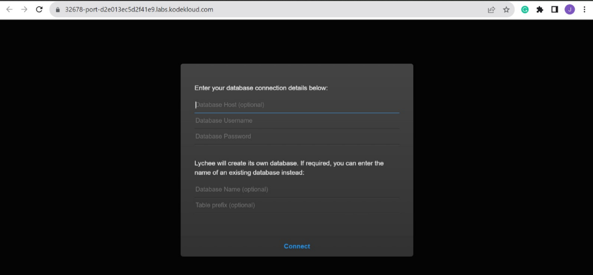

------------------------------

Start: &nbsp;&nbsp;&nbsp;&nbsp;&nbsp;&nbsp;&nbsp;&nbsp;2023-08-17 13:10:55  
Finished: &nbsp;&nbsp;2023-08-17 13:57:00

------------------------------

- [Requirements](#requirements)
- [Steps](#steps)
- [Resources](#resources)

------------------------------

# Lab 009: Deploy Iron Gallery App on Kubernetes

## Requirements

There is an iron gallery app that the Nautilus DevOps team was developing. They have recently customized the app and are going to deploy the same on the Kubernetes cluster. Below you can find more details:

- Create a namespace **iron-namespace-xfusion**

- Create a deployment **iron-gallery-deployment-xfusion** for iron gallery under the same namespace you created.

    - Labels **run** should be **iron-gallery**.

    - **Replicas** count should be **1**.

    - Selector's matchLabels **run** should be **iron-gallery**.

    - Template labels **run** should be **iron-gallery** under metadata.

    - The container should be named as **iron-gallery-container-xfusion**, use **kodekloud/irongallery:2.0** image ( use exact image name / tag ).

    - Resources limits for **memory** should be **100Mi** and for **CPU** should be **50m**.

    - **First  volumeMount** name should be **config**, its **mountPath** should be **/usr/share/nginx/html/data**.

    - **Second  volumeMount** name should be **images**, its mountPath should be **/usr/share/nginx/html/uploads**.

    - **First volume name** should be **config** and give it **emptyDir** and **second volume name** should be **images**, also give it **emptyDir**.

- Create a deployment **iron-db-deployment-xfusion** for iron db under the same namespace.

    - Labels **db** should be **mariadb**.

    - **Replicas** count should be **1**.

    - Selector's matchLabels **db** should be **mariadb**.

    - Template labels **db** should be **mariadb** under metadata.

    - The container name should be **iron-db-container-xfusion**, use **kodekloud/irongallery:2.0** image ( use exact image name / tag ).

    - Define environment:
    
        - **MYSQL_DATABASE** its value should be **database_apache**
        - **MYSQL_ROOT_PASSWORD** and **MYSQL_PASSWORD** value should be with some complex passwords for DB connections
        - **MYSQL_USER** value should be any custom user ( except root )

    - **Volume mount name** should be **db** and its mountPath should be **/var/lib/mysql.**
    - **Volume name** should be **db** and give it an **emptyDir**.

- Create a **service** for iron db which should be named **iron-db-service-xfusion** under the same namespace. Configure spec as selector's **db** should be **mariadb**. **Protocol** should be **TCP**, **port** and **targetPort** should be **3306** and its **type** should be **ClusterIP**.

- Create a **service** for iron gallery which should be named **iron-gallery-service-xfusion** under the same namespace. Configure spec as selector's **run** should be **iron-gallery**. **Protocol** should be **TCP**, **port** and **targetPort** should be **80**, **nodePort** should be **32678** and its **type** should be **NodePort**.


Note:

- We don't need to make connection b/w database and front-end now, if the installation page is coming up it should be enough for now.

- The kubectl on jump_host has been configured to work with the kubernetes cluster.


------------------------------

## Steps

Check the resources.

```bash
thor@jump_host ~$ kubectl get ns,pods,deploy
NAME                           STATUS   AGE
namespace/default              Active   5m56s
namespace/kube-node-lease      Active   5m56s
namespace/kube-public          Active   5m56s
namespace/kube-system          Active   5m56s
namespace/local-path-storage   Active   5m48s  
```

Create the **deploy.yml**.

```bash
--- 
apiVersion: v1
kind: Namespace
metadata:
  name: iron-namespace-xfusion
  labels:
    name: iron-namespace-xfusion
---
apiVersion: apps/v1
kind: Deployment
metadata:
  name: iron-gallery-deployment-xfusion
  namespace: iron-namespace-xfusion
  labels:
    run: iron-gallery
spec:
  replicas: 1
  selector:
    matchLabels:
      run: iron-gallery
  template:
    metadata:
      labels:
        run: iron-gallery
    spec:
      volumes:
        - name: config
          emptyDir: {}
        - name: images
          emptyDir: {}
      containers:
        - name: iron-gallery-container-xfusion
          image: kodekloud/irongallery:2.0
          volumeMounts:
            - name: config
              mountPath: /usr/share/nginx/html/data
            - name: images
              mountPath: /usr/share/nginx/html/uploads
          resources:
            limits:
              memory: "100Mi"
              cpu: "50m"    
---
apiVersion: apps/v1
kind: Deployment
metadata:
  name: iron-db-deployment-xfusion
  namespace: iron-namespace-xfusion
  labels:
    db: mariadb
spec:
  replicas: 1
  selector:
    matchLabels:
      db: mariadb
  template:
    metadata:
      labels:
        db: mariadb
    spec:
      volumes:
        - name: db
          emptyDir: {}
      containers:
        - name: iron-db-container-xfusion
          image: kodekloud/irondb:2.0
          env:
            - name: MYSQL_DATABASE
              value: database_apache
            - name: MYSQL_ROOT_PASSWORD
              value: admin123
            - name: MYSQL_PASSWORD
              value: admin123
            - name: MYSQL_USER
              value: kodekloud
          volumeMounts:
            - name: db
              mountPath: /var/lib/mysql

---
apiVersion: v1
kind: Service
metadata:
  name: iron-db-service-xfusion
  namespace: iron-namespace-xfusion
spec:
  type: ClusterIP
  selector:
    db: mariadb
  ports:
    - port: 3306
      targetPort: 3306
      protocol: TCP
---
apiVersion: v1
kind: Service
metadata:
  name: iron-gallery-service-xfusion
  namespace: iron-namespace-xfusion
spec:
  type: NodePort
  selector:
    run: iron-gallery
  ports:
    - port: 80
      targetPort: 80
      nodePort: 32678
      protocol: TCP  
```

Apply. 

```bash
kubectl apply -f .
```

Check the resources again.

```bash
thor@jump_host ~$ k get ns
NAME                     STATUS   AGE
default                  Active   7m14s
iron-namespace-xfusion   Active   46s
kube-node-lease          Active   7m14s
kube-public              Active   7m14s
kube-system              Active   7m14s
local-path-storage       Active   7m6s  
```

```bash
thor@jump_host ~$ k get all -n iron-namespace-xfusion
NAME                                                   READY   STATUS    RESTARTS   AGE
pod/iron-db-deployment-xfusion-8576c6fccd-fhf46        1/1     Running   0          56s
pod/iron-gallery-deployment-xfusion-785f55d854-hc9x2   1/1     Running   0          56s

NAME                                   TYPE        CLUSTER-IP     EXTERNAL-IP   PORT(S)        AGE
service/iron-db-service-xfusion        ClusterIP   10.96.92.190   <none>        3306/TCP       56s
service/iron-gallery-service-xfusion   NodePort    10.96.8.209    <none>        80:32678/TCP   55s

NAME                                              READY   UP-TO-DATE   AVAILABLE   AGE
deployment.apps/iron-db-deployment-xfusion        1/1     1            1           56s
deployment.apps/iron-gallery-deployment-xfusion   1/1     1            1           56s

NAME                                                         DESIRED   CURRENT   READY   AGE
replicaset.apps/iron-db-deployment-xfusion-8576c6fccd        1         1         1       56s
replicaset.apps/iron-gallery-deployment-xfusion-785f55d854   1         1         1       56s 
```

To verify, click the **App** button. It should open a new tab.


In the new tab, we should see: 




------------------------------

## Resources

- https://gitlab.com/nb-tech-support/devops/-/blob/master/Deploy_Iron_Gallery_App_on_Kubernetes/iron_service.yaml?ref_type=heads